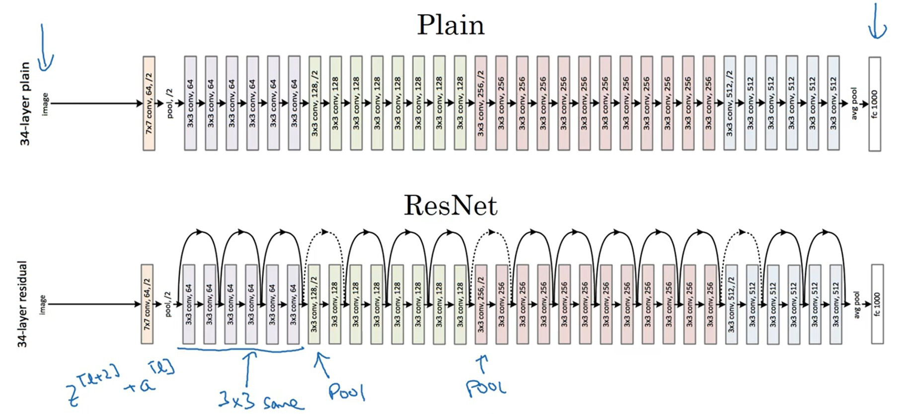
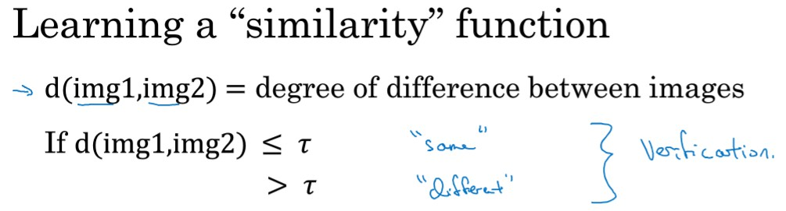
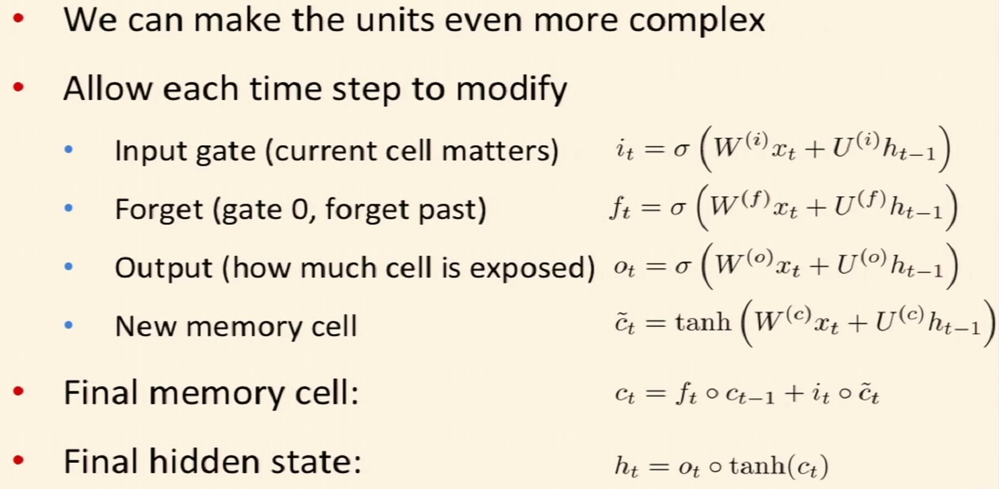
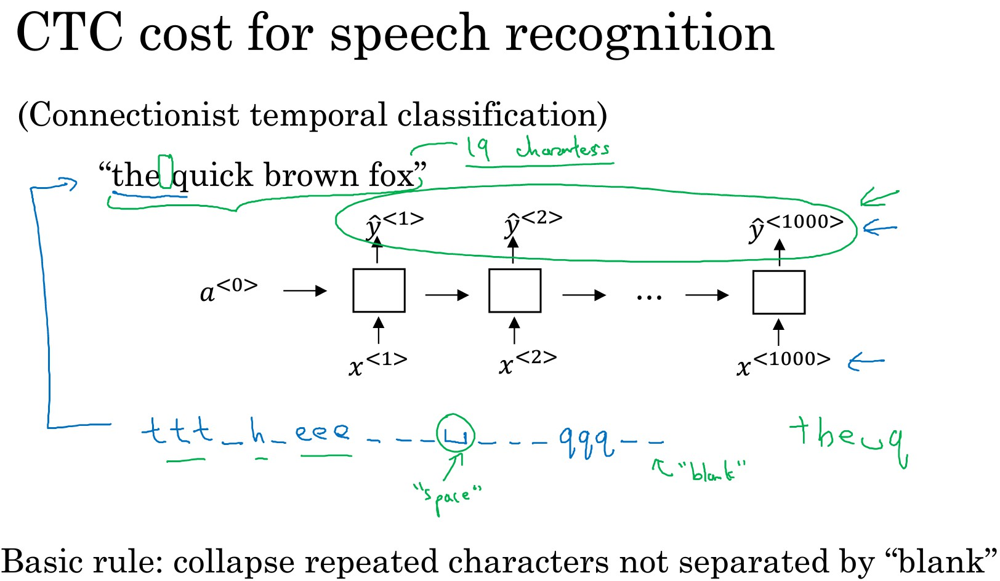

# Deep Learning

## DNN

### Forward Propagation

$$
Z^l = W^l A^{l-1} + b^l \\
A^l = g(Z^l) \\
\hat{y} = A^L \\
\mathcal{L} = \frac{1}{m} \sum_{i=1}^m y_ilog\hat{y_i} + (1-y_i)log(1-\hat{y}_i)
$$

### Backward Propagation

$$
\frac{\partial \mathcal{L} }{\partial W^l} = \frac{\partial \mathcal{L}}{\partial A^l} \cdot \frac{\partial A^l}{\partial Z^l} \cdot \frac{\partial Z^l}{\partial W^l} = \frac{\partial \mathcal{L}}{\partial A^{l+1}} \cdot \frac{\partial A^{l+1}}{\partial A^l} \cdot g'(Z^l) \cdot A^{l-1} \\

\frac{\partial \mathcal{L} }{\partial b^l} = \frac{\partial \mathcal{L}}{\partial A^l} \cdot \frac{\partial A^l}{\partial Z^l} \cdot \frac{\partial Z^l}{\partial b^l} = \frac{\partial \mathcal{L}}{\partial A^{l+1}} \cdot \frac{\partial A^{l+1}}{\partial A^l} \cdot g'(Z^l) \\

\frac{\partial \mathcal{L} }{\partial A^l} = \frac{\partial \mathcal{L}}{\partial A^{l+1}} \cdot \frac{\partial A^{l+1}}{\partial A^l} = \frac{\partial \mathcal{L}}{\partial A^{l+1}} \cdot \frac{\partial A^{l+1}}{\partial Z^{l+1}} \cdot \frac{\partial Z^{l+1}}{\partial A^l} = \frac{\partial \mathcal{L}}{\partial A^{l+1}} \cdot g'(Z^{l+1}) \cdot W^{l}
$$

### Problems

#### Gradients Vanishing/Exploding

以下两种方法能有效避免梯度消失/爆炸问题

- Xavier initialization
  - Normal Distribution or Uniform Distribution
- He initialization
  - $Xavier\times \sqrt{2/ \text{dimension of the previous layer}}$

#### Bias & Variance

- High Bias (欠拟合，没有很好的拟合训练集和交叉验证集)
  - 扩大网络规模
  - 用更长的时间训练（Momentum, RMSprop, Adam等优化算法）
  - 换模型
- High Variance (过拟合，很好的拟合了训练集，但在交叉验证集上表现不好)
  - 获取更多数据
  - 正则化
  - 换模型

### 优化算法

#### 正则化

- **L2 Regularization**

  The standard way to avoid overfitting is called **L2 regularization**. It consists of appropriately modifying your cost function, from:
  $$
  J = -\frac{1}{m} \sum\limits_{i = 1}^{m} \large{(}\small  y^{(i)}\log\left(a^{[L](i)}\right) + (1-y^{(i)})\log\left(1- a^{[L](i)}\right) \large{)}
  $$
  To:
  $$
  J_{regularized} = \small \underbrace{-\frac{1}{m} \sum\limits_{i = 1}^{m} \large{(}\small y^{(i)}\log\left(a^{[L](i)}\right) + (1-y^{(i)})\log\left(1- a^{[L](i)}\right) \large{)} }_\text{cross-entropy cost} + \underbrace{\frac{1}{m} \frac{\lambda}{2} \sum\limits_l\sum\limits_k\sum\limits_j W_{k,j}^{[l]2} }_\text{L2 regularization cost}
  $$

  The regularization term's gradient is 
  $$
  \frac{d}{dW} ( \frac{1}{2}\frac{\lambda}{m}  W^2) = \frac{\lambda}{m} W
  $$

- **Dropout**: randomly shuts down some neurons in each iteration (see videos from Section2)

#### 标准化 (z-score, min-max)

#### Batch Norm

$$
Z_{norm}^{[l]}=\frac{Z^{[l]}-\mu}{\sqrt{\sigma^2+\epsilon}} \\
\tilde{Z}^{[i]}=\gamma Z_{norm}^{[i]} + \beta \\
A^{[i]} = W^{[i]}\tilde{Z}^{[i]} + b
$$
$\gamma, \beta​$ 分别为标准差和平均值，$\gamma=\sqrt{\sigma^2+\epsilon}, \beta=\mu​$ 时 $\tilde{Z}^{[i]} = Z^{[i]}​$

#### Mini-Batch Gradient descent

batch-size = training set size 时变为 batch gradient desent 即普通的梯度下降

batch-size = 1 时变为随机梯度下降

#### Momentum (动量梯度下降)

减少梯度在波动方向的值

$$
v_{dW^{[l]}} = \beta v_{dW^{[l]}} + (1 - \beta) \frac{\partial \mathcal{J} }{ \partial W^{[l]} } \\
v^{corrected}_{dW^{[l]}} = \frac{v_{dW^{[l]}}}{1 - (\beta)^t} \\
W^{[l]} = W^{[l]} - \alpha v^{corrected}_{dW^{[l]}}
$$

#### RMSprop

$$
s_{dW^{[l]}} = \beta s_{dW^{[l]}} + (1 - \beta) (\frac{\partial \mathcal{J} }{\partial W^{[l]} })^2 \\
s^{corrected}_{dW^{[l]}} = \frac{s_{dW^{[l]}}}{1 - (\beta)^t} \\
W^{[l]} = W^{[l]} - \alpha \frac{dW^{[l]}}{\sqrt{s_{dW^{[l]}} + \epsilon}}
$$

#### Adam

Momentum + RMSprop
$$
\begin{cases}
v_{dW^{[l]}} = \beta_1 v_{dW^{[l]}} + (1 - \beta_1) \frac{\partial \mathcal{J} }{ \partial W^{[l]} } \\
v^{corrected}_{dW^{[l]}} = \frac{v_{dW^{[l]}}}{1 - (\beta_1)^t} \\
s_{dW^{[l]}} = \beta_2 s_{dW^{[l]}} + (1 - \beta_2) (\frac{\partial \mathcal{J} }{\partial W^{[l]} })^2 \\
s^{corrected}_{dW^{[l]}} = \frac{s_{dW^{[l]}}}{1 - (\beta_2)^t} \\
W^{[l]} = W^{[l]} - \alpha \frac{v^{corrected}_{dW^{[l]}}}{\sqrt{s^{corrected}_{dW^{[l]}}} + \varepsilon}
\end{cases}
$$

#### 学习率衰减

$$
\alpha = \frac{1}{1+decay\_rate \cdot epoch\_num}\alpha_0 \\
\alpha = 0.95^{epoch\_num} \cdot \alpha_0 \\
\alpha = \frac{k}{\sqrt{epoch\_num}} \cdot \alpha_0 \\
$$

或者使用离散的 $\alpha$

### 调参

#### 需要调试的超参数

- **learning rate $\alpha$**
- **number of hidden units**
- **mini-batch size**
- number of layers
- learning rate decay
- Momentum: $\beta=0.9$ 
- Adam: $\beta_1=0.9, \beta_2=0.999, \epsilon=10^{-8}$

#### 激活函数

- Sigmoid
$$
\sigma(x) = \frac{1}{1+e^{-x}}
$$

- tanh
$$
tanh(x) = \frac{1-e^{-2x}}{1+e^{-2x}}
$$

- ReLU
$$
f(x) = max(0, x)
$$

- Leaky ReLu

- ELU

- Softmax

  逻辑回归的推广（多分类器），函数值为一个概率向量，选取概率最大类的作为输出

$$
\sigma(z)_j = \frac{e^{z_j}}{\sum_{k=1}^K e^{z_k}}
$$
#### How?

1. 用对数轴选取合适的范围($10^{-4}, 10^{-3}, \ldots, 10^{-1}, 10^0$)
2. 随机取值
3. 缩小范围

#### Error Analysis

## 迁移学习

- 更换其他任务的数据重新训练模型（让模型预先学习相似问题）
- 通常将数据量大的任务迁移到数据量小的任务

## 多任务学习

- 用一个模型去干n件事而不是用n个模型分别去干（共用相似底层特征会使得模型表现更好）
- 通常各个任务的数据比较相似
- 通常网络规模较大

## 端对端深度学习

- 不需要预处理、特征工程等工作，直接将数据输入模型得到结果
- 通常需要较大的数据集

## CNN

### 卷积

如果图像大小为 $n \times n$，filter大小为 $f \times f$，填充大小为 $p$，卷积步长为 $s$，则卷积结果的大小为
$$
\lfloor \frac{n+2p-f}{s}+1 \rfloor \times \lfloor \frac{n+2p-f}{s}+1 \rfloor
$$
其中 $p$ 通常取奇数

### Forward Propagation

#### Convolutional Layer

$$
a^l = g(a^{l-1} * f^l + b^l) \\
a^l.shape = \lfloor \frac{n^{[l-1]}_H+2p-f^l}{s^l} \rfloor \times  \lfloor \frac{n^{[l-1]}_W+2p-f^l}{s^l} \rfloor \times f^l_c
$$

一般 $h$ 和 $w$ 越来越小，$f^l_c$ 越来越大

Advantages:

- 参数共享 (Parameter sharing): A feature detector that's useful in one part of the image is  probably useflu in another part
- 稀疏连接 (Sparsity of connections): In each layer, each output value depends only on a small number of inputs

#### Pooling Layer

- Max Pooling

- Average Pooling

通常取 $f=2, s=2$

### Architectures

#### LeNet-5

#### AlexNet

#### VGG-16

#### ResNet

Residual block

ResNet

#### Inception Network

$1\times 1$ Convolution layer 可以减小 c 从而降低计算成本

### Data Augmentation

- 水平翻转（镜像）
- 随机裁剪
- 色彩变换 (PCA Color Augmentation)
- 旋转
- 局部扭曲

### Object Detection

#### Classification with Localization

在神经网络的输出增加 $b_x, b_y, b_h, b_w$，表示目标物体的位置

#### Landmark Detection

在神经网络的输出增加特征点的位置

#### Sliding Windows Detection

遍历图片中的各个区域，将每个区域喂给神经网络

将CNN中的全连接层换成 $1 \times 1$ 的卷积层即可高效得计算出每个窗口的预测结果

#### YOLO (You Only Look Once)

将图片分成 $n \times n​$ 的网格然后喂给CNN输出 $b_x, b_y, b_h, b_w​$

##### Intersection over Union

$$
IoU = \frac{\text{size of Intersection}}{\text{size of Union}}
$$

Usually, Correct if $IoU \ge 0.5$

##### Non-max suppression

选取概率最高的区域，然后抑制和该区域 $IoU$ 高的区域

##### Anchor Box

同时输出多个结果，分别对应不同的Anchor Box。如果实际物体数目多于Anchor Box数目或者有不同的物体属于相同的Anchor Box则该算法无法正确分辨。

#### Region proposal: R-CNN

利用图像分割 (segmentation) 算法选出可能存在物体的区域再将区域喂给神经网络输出 label 和边界

Fast R-CNN: 卷积实现 Sliding Windows 加快 R-CNN

Faster R-CNN: 利用卷积选出区域

### Face Recognition

#### One-shot Learning

#### Siamese Network

#### Triplet Loss

$$
\mathcal{L}(A, P, N) = max(0, d(A, P) - d(A, N) + \alpha) \\
J = \sum_{i=1}^m \mathcal{L}(A^{(i)}, P^{(i)}, N^{(i)})
$$

其中 $A, P, N$ 分别为 Anchor, Positive, Negative

#### Binary Classification

用逻辑回归判断两个输入是否为同一个人，将 $f(x)^{(i)}$ 的每个元素作为特征 (see paper DeepFace)

### Neural Style Transfer

Random Initialize -> Minimize Cost Function
$$
J(G) = \alpha J_{content}(C, G) + \beta J_{style}(S, G)
$$
其中 C, S, G 分别为Content, Style, Generated Picture
$$
J_{content}(C, G) = \frac{1}{2} \| a^{[l](C)} - a^{[l](G)} \|^2
$$
其中 $a^{[l](C)}$ 是C在第l层的激活函数值

$$
G^{[l](S)}_{kk'} = \sum^{n^{[l]}_H}_{i=1} \sum^{n^{[l]}_W}_{j=1} a^{[l](S)}_{ijk} \cdot a^{[l](S)}_{ijk'} \\
G^{[l](G)}_{kk'} = \sum^{n^{[l]}_H}_{i=1} \sum^{n^{[l]}_W}_{j=1} a^{[l](G)}_{ijk} \cdot a^{[l](G)}_{ijk'} \\
J^{[l]}_{style}(S, G) = \frac{1}{(2{n^{[l]}_H}{n^{[l]}_W}{n^{[l]}_C})^2} \|G^{[l](S)}_{kk'}-G^{[l](G)}_{kk'}\|^2_F = \frac{1}{(2{n^{[l]}_H}{n^{[l]}_W}{n^{[l]}_C})^2} \sum_k \sum_{k'} (G^{[l](S)}_{kk'}-G^{[l](G)}_{kk'}) \\
J_{style} = \sum_l \lambda^{[l]} J^{[l]}_{style}(S, G)
$$

## RNN

### Forward Propagation

$$
a^t = g_1(W_{ax}X^t + W_{aa}a^{t-1} + b_a) \\
\hat{y}^t = g_2(W_{ya}a^t + b_y) \\
\mathcal{L} = \sum_{t=1}^T \mathcal{L^t(y^t, \hat{y}^t)}
$$

### Backward Propagation Through Time (BPTT)

$$
\frac{\partial \mathcal{L}}{\partial W_{ax}} = \frac{\partial \mathcal{L}^t}{\partial W_{ax}} \cdot \frac{\partial}{\partial W_{ax}}\sum_{i=t+1}^T\mathcal{L^i}
$$

### Architectures

#### Language Model

#### Sampling

#### GRU

#### LSTM

#### Bidirectional RNN

#### Deep RNN

### Gradients Vanishing/Exploding

- Exploding
  - Gradient Clipping
- Vanishing
  - GRU
  - LSTM

### NLP (Word Embeddings)

#### Word2Vec

##### Skip-gram

$$
\text{maximize } J'(\theta) = \prod^T_{t=1} \prod_{\substack{-m\le j \le m \\ j \ne 0}} p(w_{t+j} | w_t, \theta) \\
\text{i.e. minimize } J(\theta) = -\frac{1}{T} \sum^T_{t=1} \sum_{\substack{-m \le j \le m \\ j\ne 0}} log(p(w_{t+j} | w_t, \theta))
$$

其中 $\theta$ 为词向量，$T$ 为单词总数，$m$ 为窗口大小，$w_t$ 为 central word，$w_{t+j}$ 为 context word

可以用分层 softmax 来加速 $p(o|c)$ 的计算

如果用 SGD 训练，$\nabla_\theta J_t(\theta)$ 将会非常稀疏，导致效率低下

##### Negative Sampling

$$
J(\theta) = \frac{1}{T}\sum^T_{t=1}J_t(\theta) \\
J_t(\theta) = log \sigma(u^T_ov_c) + \sum^k_{i=1} E_{j \thicksim P(w)} [log\sigma (-u^T_jv_c)] \\
P(w) = \frac{U(w)^{3/4}}{Z}
$$

选取 k 个负样本（未出现的 center word 和 context word）

##### CBOW

#### GloVe

####Sentiment Classification

### Machine Translation

Encoder (RNN for text, CNN for image) -> Decoder (RNN) -> Language Model (Find the most likely translation)

#### Beam Search

注意每次是从所有结果中选取可能性最大的 $B$ 个而不是在 in september, jane is, jane visits 里各选一个

当句子过长时可对概率取log以避免下溢，为减少短句子的优势可以乘 length normalization term: $1/length$

Beam Search 不像 BFS, DFS 那样一定能找到最优解

#### Bleu Score

$$
p_n = \frac{\sum_{ngram \in \hat{y}} count_{clip}(ngram)}{\sum_{ngram \in \hat{y}} count(ngram)}
$$

BP = Brevity Penalty

### Attention Model

### Speech Recognition

#### Attention model

#### CTC

#### Neural Transducer

### Trigger Word Detection

