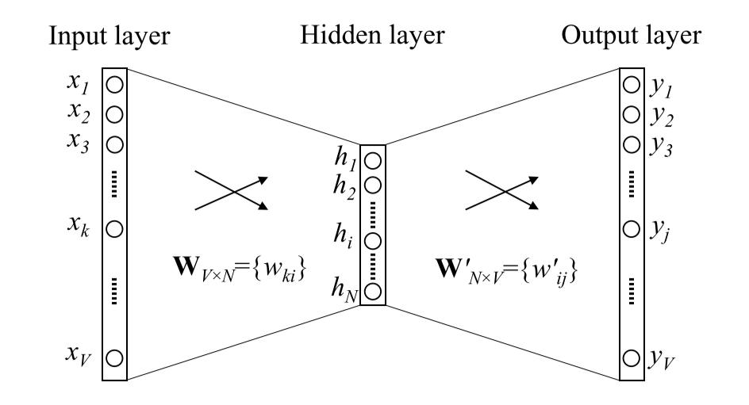
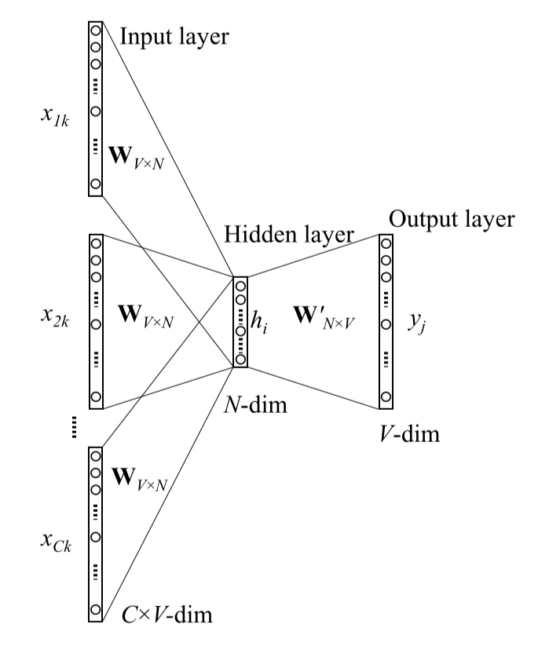
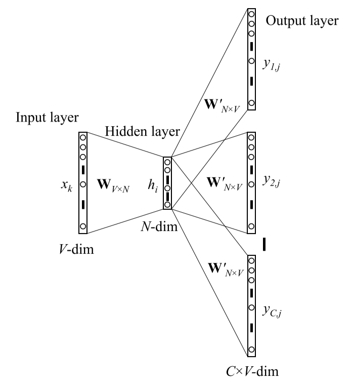
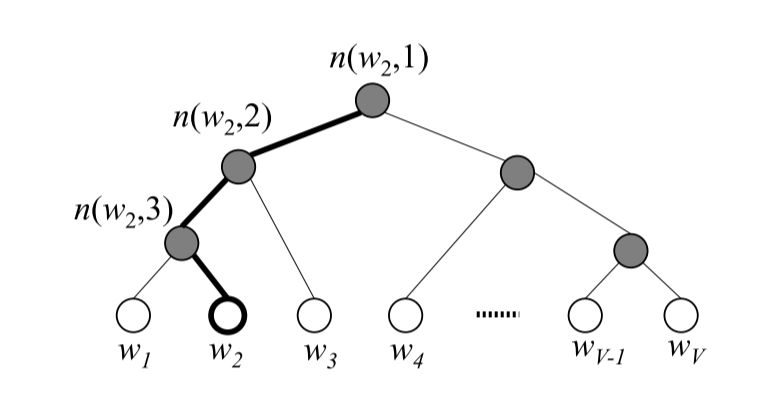

# Word Embeddings

将词“嵌入”（映射）到数值向量，这个数值向量有表征语义的功能

## Word2Vec

### Basic Models

#### CBOW (Continuous Bag-Of-Words)

对于给定的一个中心词 (Center word)，用它的上下文单词 (Context word) 作为输入，来预测这个词。

假设词汇表大小为$V$，词向量的维度为$N$。当上下文只有一个词$w_I$的时候，Word2Vec可以用如下简化的的神经网络表示

该神经网络的输入$\bold{x}$为$w_I$的One-Hot Encoding形式，只有一个隐层$\bold{h}$，并且隐层使用线性激活函数，而输出层使用softmax激活函数，输出向量$\bold{y}$表示每个单词在给定$w_I$时中心词为其他各单词的概率。因此前向传播可以表示为
$$
\bold{v}_{w_I} = \bold{W}^T\bold{x} = \bold{W}_{k,\cdot}^T \\
\bold{h} = \bold{v}_{w_I} \\
\bold{u} = \bold{W'}^T \bold{h} \\
\bold{y} = softmax(\bold{u}) \\
p(w_j | w_I) = y_j = \frac{\exp{u_j}}{\sum_{k=1}^V \exp{u_k}}
$$

由于$\bold{x}$是One-Hot Encoding，如果$x_k=1$则$\bold{v}_{w_I}$实际上是权重矩阵$\bold{W}$的第$k$行。

我们希望真实的中心词$w_O$出现的概率最大，因此使用极大似然估计最大化$w_O$的概率，即
$$
\max p(w_O | w_I) = \max  y_{j^*}
$$
其中$j^*$是$w_O$在输出向量$\bold{y}$中的下标。而最大化$p(w_O | w_I)$相当于最大化$\log p(w_O | w_I)$，因此我们将损失函数定义为
$$
\begin{aligned}
E &= -\log p(w_O | w_I) \\
&= -\log y_{j^*} \\
&= -\log\frac{\exp u_{j^*}}{\sum_{k=1}^V \exp{u_k}} \\
&= - u_{j^*}+ \log\sum_{k=1}^V \exp u_k
\end{aligned}
$$

然后就可以用梯度下降训练该神经网络了（反向传播具体的求导过程可参考参考文献1）。训练结束后就可以用神经网络的隐层作为词向量了，由于隐层$\bold{h}$实际上就是权重矩阵$\bold{W}$的某个行，因此$\bold{W}$也就是词向量矩阵了，其中第$k$行就是第$k$个单词的词向量。

不过显然上下文单词只有一个的时候结果并不准确。当使用更多的上下文单词（$C$个）时，网络结构可以变化为

这时候网络的输入变成了$C$个上下文单词$w_1, w_2, \ldots, w_C$的平均值，即
$$
\begin{aligned}
\bold{h} &= \frac{1}{C}\bold{W}^T(\bold{x}_1+\bold{x}_2+\ldots+\bold{x}_C) \\
&= \frac{1}{C}(\bold{v}_{w_1}+\bold{v}_{w_2}+\ldots+\bold{v}_{w_C})^T
\end{aligned}
$$
然后损失函数也改写为
$$
\begin{aligned}
E &= -\log p(w_O | w_1, w_2, \ldots, w_C) \\ 
&= - u_{j^*} + \log\sum_{k=1}^V \exp u_k
\end{aligned}
$$
同样可以使用梯度下降的方法训练。

#### Skip-gram

对于给定的一个中心词 ，用它作为输入，来预测这个词的上下文单词。

与只有一个上下文单词的CBOW相似，Skip-gram的输入为中心词$w_I$的One-Hot Encoding，而输出$\bold{y}_1, \bold{y}_2, \ldots, \bold{y}_C$表示对应每个上下文单词的概率分布，如下图所示

注意图中虽然画了多个$\bold{W}'_{N\times V}$，但实际上它们都是相同的一个权重矩阵，因此$\bold{y}_1, \bold{y}_2, \ldots, \bold{y}_C$实际上也是相同的。因此该神经网络的前向传播与只有一个上下文单词的CBOW是完全相同的，只不过输出的意义变为给定中心词$w_I$第$c$个上下文单词的概率分布，即
$$
p(w_{c,j} | w_I) = y_{c,j} = y_j = \frac{\exp u_j}{\sum_{k=1}^V \exp u_k}
$$
其中$w_{c,j}$表示第$c$个词为$w_j$。

而损失函数变为
$$
\begin{aligned}
E &= -\log p(w_1, w_2, \ldots, w_C | w_I) \\
&= -\sum_{c=1}^C \log p(w_c | w_I) \\
&= -\sum_{c=1}^C \log \frac{\exp u_{j_c^*}}{\sum_{k=1}^V \exp u_k} \\
&= - \sum_{c=1}^C u_{j_c^*} + C \cdot \log \sum_{k=1}^V \exp u_k
\end{aligned}
$$
其中$w_1, w_2, \ldots, w_C$是真实的上下文单词，$j_c^*$为第$c$个真实上下文单词在$\bold{y}$中的下标。同样可以用梯度下降法去训练。

### Optimizations

上述的两个基本模型虽然简洁，但是训练起来效率非常低，因为对于每个输入最后都要计算$\bold{W}'^T \bold{h}$，然后再用梯度更新矩阵$\bold{W}'$，而当词汇量大的时候矩阵$\bold{W}'$也会非常巨大，使得这一步非常的耗时。因此还有两种优化算法也被提出，分别是Hierarchical Softmax （分层softmax）和 Negative Sampling（负采样）。

#### Hierarchical Softmax

分层softmax使用了树形结构来减少基本模型中输出层的计算量。首先根据每个单词的词频，构建哈夫曼树，这样每个叶子节点都代表一个单词，并且出现频率越高的词越靠近树根，下图就是一个哈夫曼树的例子

图中加粗的路径是从树根到$w_2$的路径，这个路径的长度$L(w_2)=4$，$n(w_2, j)$表示这个路径上的第$j$个节点。使用哈夫曼树的优点就在于出现频率高的词路径长度会更短，之后的计算量会更小。

这个模型通过树形结构来计算每个单词出现的概率。具体地说，树中每个非叶子节点中都有一个向量$\bold{v}'_j$，并通过逻辑回归的方式计算下一步往左走或往右走的概率（将左子树作为负例，右子树作为正例）。以上下文单词只有一个的CBOW为例，可表示为
$$
\bold{h} = \bold{W}^T \bold{x} = \bold{v}_{w_I} \\
p(n(w,j))_{right}= \sigma(\bold{v}'^T_{n(w,j)} \bold{h}) \\
p(n(w,j))_{left} = 1-p(n(w,j))_{right} = 1-\sigma(\bold{v}'^T_{n(w,j)} \bold{h}) = \sigma(-\bold{v}'^T_{n(w,j)} \bold{h}) \\
$$
其中$\sigma(\cdot)$为sigmoid函数，即
$$
\sigma(x) = \frac{1}{1-e^{-x}}
$$
如果用$d(n(w, j))$表示$n(w, j+1)$相对于$n(w, j)$方向（$0$为左，$1$为右），那么可将下一个节点出现的概率写为
$$
p(n(w,j+1)) = 
\begin{cases}
p(n(w,j))_{left} = \sigma(-\bold{v}'^T_{n(w,j)} \bold{h}), & d(n(w,j))=0 \\
p(n(w,j))_{right}= \sigma(\bold{v}'^T_{n(w,j)} \bold{h}),  & d(n(w,j))=1
\end{cases}
$$
其中$j=1, 2, \ldots, L(w_O)-1$，并且认为根节点出现的概率为$1$。

那么单词$w_O$出现的概率就是它路径上每个节点出现的概率的乘积，即
$$
p(w_O|w_I) = \prod_{j=1}^{L(w_O)-1} p(n(w_O,j+1))
$$

以上图为例，$w_2$出现的概率为
$$
\begin{aligned}
p(w_2 | w_I) &= p(n(w_2,1))\cdot p(n(w_2,2))\cdot p(n(w_2, 3))\cdot p(w_2) \\
&= 1 \cdot p(n(w_2,1))_{left} \cdot p(n(w_2, 2))_{left} \cdot p(n(w_2, 3))_{right}
\end{aligned}
$$
同样通过极大似然来构造损失函数
$$
E = -\log p(w_O|w_I) = -\sum_{j=1}^{L(w_O)-1} \log p(n(w_O,j+1))
$$

然后用梯度下降更新$\bold{v}_{w_I}$和$\bold{v}'_{n(w,j)}$，然后就可以得到词向量了。

与之前相同，推广到上下文单词数量为$C$的CBOW只需将隐层变为$\bold{h} = \frac{1}{C} \sum_{c=1}^C \bold{v}_{w_c}$，Skip-gram只需将损失函数变为
$$
\begin{aligned}
E &= -\log p(w_1, w_2, \ldots, w_c | w_I) \\
&= -\sum_{c=1}^C \log p(w_c | w_I) \\
&= -\sum_{c=1}^C \sum_{j=1}^{L(w_c)-1} \log p(n(w_c, j+1))
\end{aligned}
$$

#### Negative Sampling

分层softmax使用树形结构大大减少了损失函数的计算量，但是对于生僻的词，计算量仍然比较大。负采样模型的思想则更加简单，每次并不更新全部的$\bold{W}'$矩阵，而是只更新一部分，而这个部分是由采样出的一些负例（正例是真实的中心词或上下文单词）决定的，因此这个方法叫负采样。

具体采样的过程也很简单，直接根据概率采样就可以，而概率可以直接由单词在语料库中初见的次数估算，即
$$
p(w_i) = \frac{N_{w_i}}{\sum_{j=1}^V N_{w_j}}
$$

其中$N_{w_i}$是单词$w_i$在语料库中出现的次数。在Word2Vec中，实际对$N_{w_i}$取了$3/4$次幂，即

$$
p(w_i) = \frac{N_{w_i}^{3/4}}{\sum_{j=1}^V N_{w_j}^{3/4}}
$$

然后根据这个概率采样出$neg$个负例，对于每个单词，通过逻辑回归的方式计算它是正例或者负例的概率，如果用$w_O$表示正例，$w_1, w_2, \ldots, w_{neg}$表示负例，假设每个单词有一个词向量$\bold{v}$和一个输出向量$\bold{v}'$（相当于原来的$\bold{W}$矩阵和$\bold{W}'$矩阵），以只有一个上下文单词的CBOW为例，那么
$$
\bold{h} = \bold{v}_{w_I} \\
p(w_O | w_I) = \sigma(\bold{v}'^T_{w_O} \bold{h}) \\
p(w_j | w_I) = 1 - \sigma(\bold{v}'^T_{w_j} \bold{h}) = \sigma(-\bold{v}'^T_{w_O} \bold{h}), j=1, 2, \ldots, neg
$$

则所选正例和负例同时出现的概率为
$$
p(w_O, w_1, w_2, \ldots, w_{neg} | w_I) = p(w_O | w_I) \prod_{j=1}^{neg} p(w_j | w_I)
$$
同样通过极大似然来定义损失函数
$$
\begin{aligned}
E &= -\log p(w_O, w_1, w_2, \ldots, w_{neg} | w_I) \\
&= -\log p(w_O | w_I) - \sum_{j=1}^{neg} \log p(w_j | w_I) \\
&= -\log \sigma(\bold{v}'^T_{w_O} \bold{h}) - \sum_{j=1}^{neg} \log \sigma(-\bold{v}'^T_{w_j} \bold{h})
\end{aligned}
$$

然后再用梯度下降训练就可以得到词向量。推广到上下文单词数量为$C$的CBOW只需将隐层变为$\bold{h} = \frac{1}{C} \sum_{c=1}^C \bold{v}_{w_c}$，Skip-gram只需将损失函数变为
$$
\begin{aligned}
E &= -\log p(w_{p_1}, w_{p_2}, \ldots, w_{p_c}, w_{n_1}, w_{n_2}, \ldots, w_{n_{neg}} | w_I) \\ 
&= -\sum_{c=1}^C \log p(w_c | w_I) - \sum_{j=1}^{neg} \log p(w_j | w_I) \\
&= -\sum_{c=1}^C \log \sigma(\bold{v}'^T_{w_c} \bold{h}) - \sum_{j=1}^{neg} \log \sigma(-\bold{v}'^T_{w_j} \bold{h})
\end{aligned}
$$

## GloVe

## FastText

## Evaluation

## References

1. Rong X. word2vec Parameter Learning Explained.[J]. arXiv: Computation and Language, 2014. 
2. [word2vec原理(三) 基于Negative Sampling的模型](https://www.cnblogs.com/pinard/p/7249903.html)
3. 