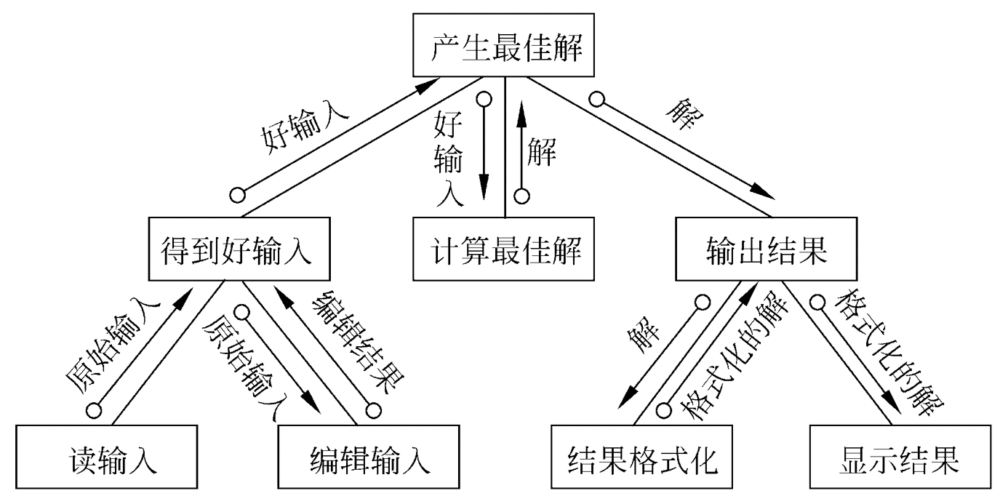
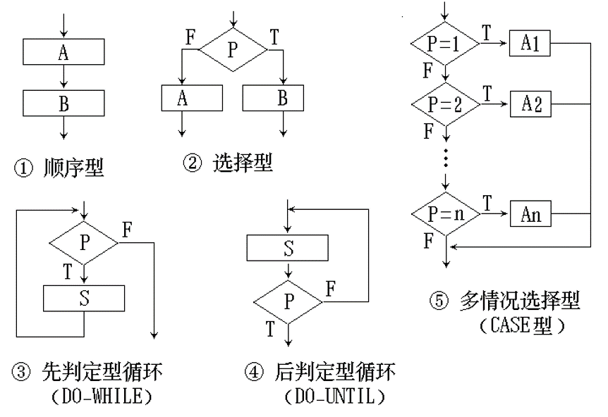
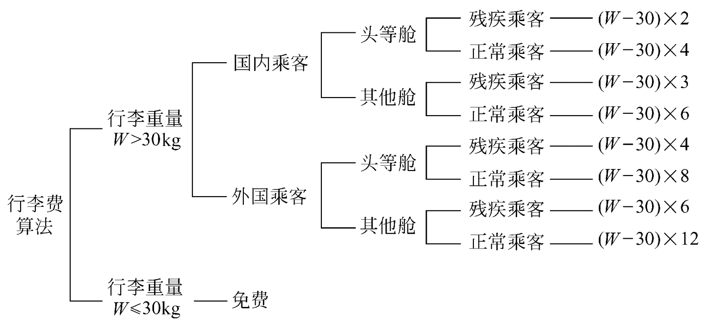
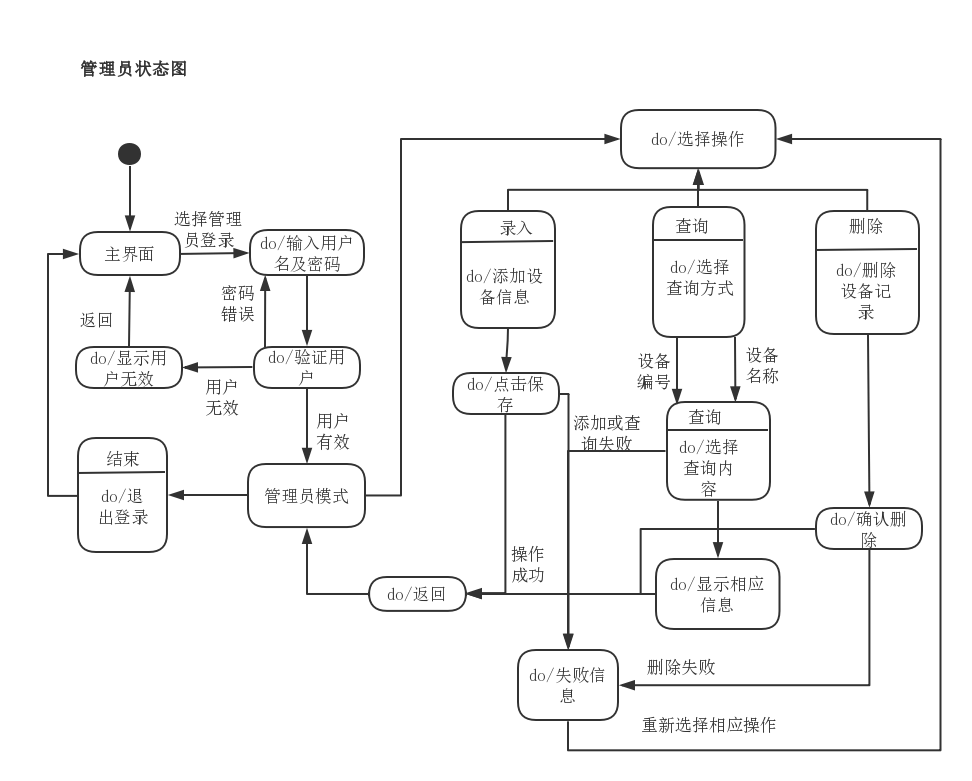
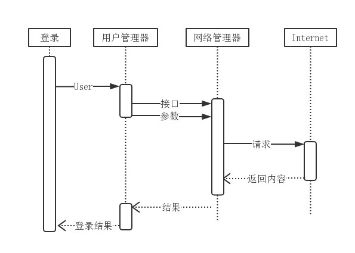
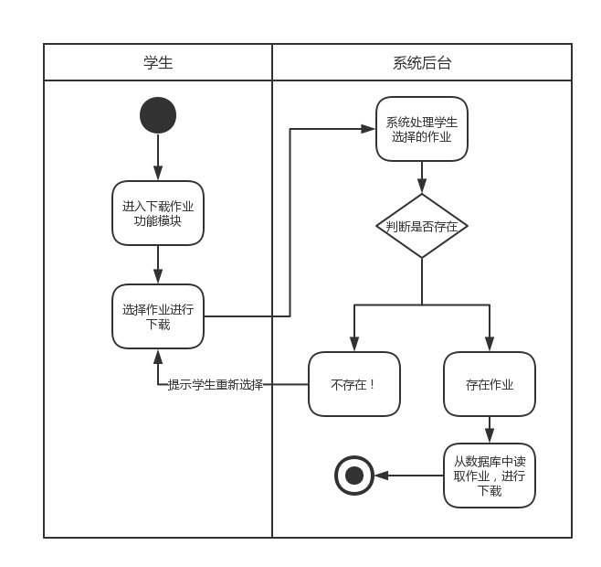
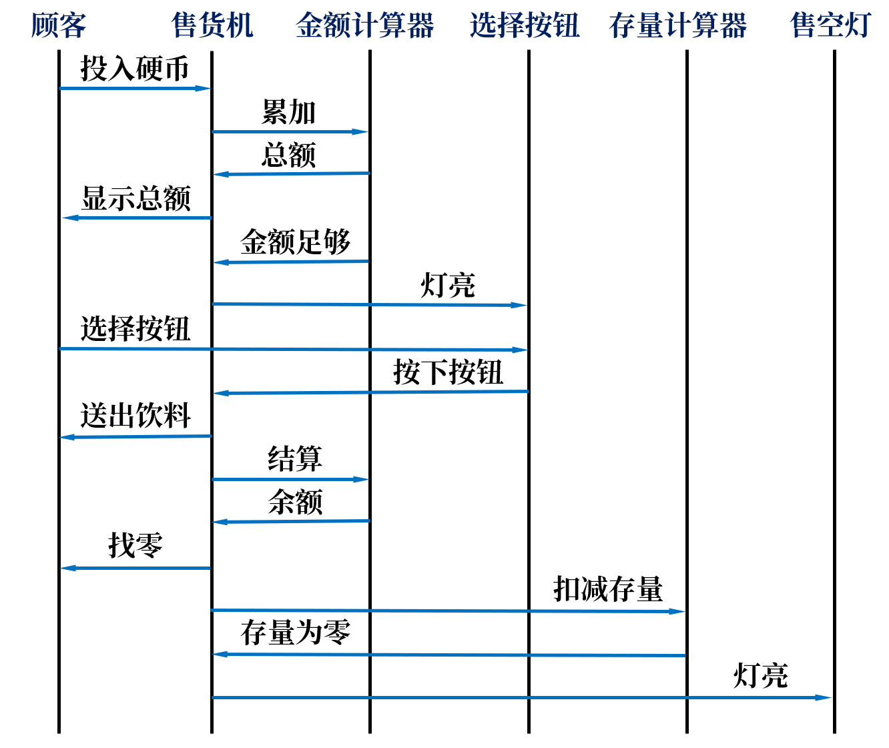

# 玄学工程

##  第一章：软件工程学概述

- 软件是包括**程序**，**数据**及其相关**文档**的完整集合
- 产生软件危机的原因
  - 与**软件本身特点**有关
  - 与开发与维护的**方法不正确**有关

### 软件生命周期

1. 问题定义
2. 可行性研究
3. 需求分析
4. 概要设计（总体设计）
5. 详细设计（模块设计）
6. 编码和单元测试
7. 综合测试
8. 软件维护

### 软件过程

- 瀑布模型
  - 特点
    - 阶段间具有顺序性和依赖性
    - 推迟实现的观点（推迟程序的物理实现，避免急于求成导致返工）
    - 质量保证的观点（每个阶段都要评审，尽早发现并纠正错误）
  - 优点
    - 提供了一种规范，使得分析、设计、编码、测试与维护工作可以在该规范的指导下有序地展开，避免了软件开发、维护过程中的随意状态
    - 对于需求确定、不随时间发生变化的项目，瀑布模型仍然是一种可以考虑采用的过程模型
  - 缺点
    - 完全依赖静态文档
    - 瀑布倒流则开发成本高
    - 出现“阻塞”状态
- 快速原型模型
  - 特点
    - 不带“反馈环”，线性顺序开发
    - 快速原型的本质是“快速”（尽可能使用快速开发工具尽快地建造出原型系统，以加速软件开发过程，节约软件开发成本）
    - 原型的用途是获知用户的真正需求，一旦需求确定了，原型将被完全或部分抛弃
  - 优点
    - 减少由于需求的不明确而带来的开发风险
  - 缺点
    - 不适用于大型复杂系统的开发
    - 缺乏规范化的文档，内部结构可能不够好
- 增量模型
  - 特点
    - 把软件产品作为一系列的增量构件来设计、编码、集成和测试
    - 每个构件由多个相互作用的模块构成，并且能够完成特定的功能
    - 第一个增量构件往往实现软件的基本需求，提供最核心的功能，然后以“滚雪球”的方式逐步扩充系统功能
    - 瀑布、快速原型模型力求一次性给用户完整的系统；而增量模型逐步增加系统功能
  - 优点
    - 较短时间内提交可以部分工作的产品
    - 减少全新产品带给客户的冲击
    - 重要功能被首先交付使用，可以得到更多测试
  - 缺点
    - 集成新的增量构件时，必须保证不破坏原有系统（需要开放式架构）
- 螺旋模型
  - 特点
    - 使用原型和风险分析相结合来尽量**降低风险**
    - 可以理解为在每个阶段之前都增加了风险分析过程的快速原型模型
  - 优点
    - 对可选方案和约束条件的强调有利于已有软件的重用
    - 有助于把软件质量作为软件开发的重要目标
    - 减少了过多/过少测试带来的风险
    - 维护作为开发的一个周期，与开发没有本质区别
    - **风险驱动**型：风险过大时能及时终止项目
  - 缺点
    - 风险驱动：需要专业的风险评估人员
- 喷泉模型
  - 特点
    - 以用户需求为动力，以对象为驱动的模型，是典型的面向对象生命周期模型
    - 体现了面向对象软件开发过程**迭代**和**无缝**的特性

## 第二章：可行性研究

- 主要研究四个方面的可行性
  - 技术可行性
  - 经济可行性
  - 操作可行性
  - 法律、社会效益可行性

### 系统流程图

- 基本符号：

  

### 数据流图(DFD)

- 基本符号：

  

- 附加符号：

  

- 在多层数据流图中，顶层流图仅包含一个加工，它代表被开发系统。

- 中间层流图则表示对其上层父图的细化，其每一加工可能继续细化，形成子图。

- 底层流图是指其加工不需再做分解（基本加工）的数据流图，其处于分层流图的最底层。

- 命名注意事项

  - 数据流名：表单名称，如“订单”，“收款单”等
  - 加工名：动词或及物动词加宾语，如“编辑订单”等
  - 文件名：名词，如“商品库存”，“商品名册”等
  - 源或宿：实际的人员或组织，如“顾客”，“供应商”等

- 用途

  - 基本目的：交流信息的工具
    - 不涉及物理细节，便于用户理解和评价
    - 当一张数据流图处理多于9个时，需要进行分层细化
  - 分析和设计的工具
    - 在数据流图上划分自动化边界
    - 不同的边界划分可对应不同的物理系统

#### 系统流程图和数据流图的区别

- 相同点
  - 具有相同功能和目标（都表达了系统中数据流动的情况）
- 不同点
  - 系统流程图涉及到目标系统的物理处理部件，如磁盘、磁带、显示器等；而DFD仅关注过程内数据的处理，而把具体处理数据的物理部件和物理分布忽略。
  - 系统流程图因为涉及到目标系统的物理处理部件，因而符号较多，而DFD中则仅有4种基本符号。
  - DFD涉及到系统之外的人和组织（起点和终点），而系统流程图仅涉及系统的内部部件。

### 数据字典

- 数据字典的内容
  - 数据流
  - 数据项(组成数据流和文件的数据)
  - 文件(数据存储)
  - 加工(处理)
  - 源或宿
- 符号

|           符号            |  含义  |          解释           |
| :---------------------: | :--: | :-------------------: |
|            =            | 被定义为 |                       |
|            +            |  与   |                       |
|       [...\|...]        |  或   |      `|`隔开供选择的分量      |
| $^m_n\{...\}$ 或 m{...}n |  重复  |       m, n为上下限        |
|          (...)          |  可选  |      括号内的分量可有可无       |
|           ..            | 连接符  | $x=1..9$ 表示取1到9中任意一个值 |

- 用途

  - 分析阶段的工具
    - 便于分析员和用户之间的交互
  - 开发阶段的公共标准
    - 避免模块间接口出现问题
  - 容易估计改变数据对其相应模块所产生的影响
  - 设计和开发数据库的第一步

- 人工卡片上主要应该包含：

  > 名字、别名、描述、定义、位置

## 第三章：需求分析

- 结构化分析方法应建立数据模型、功能模型和行为模型

### 数据模型（对应E-R图）

- 数据模型包含三种相互关联的信息：**数据对象**、描述数据对象**属性**及数据对象彼此间相互连接的**关系**。

### 功能模型（对应数据流图）

### 行为模型

#### 状态转换图

- 状态转换图：通过描绘系统的状态及引起系统状态转换的事件，来表示系统的**行为**

### 其他图形工具

#### 层次方框图

#### Warnier图

- 花括号内的信息条目构成顺序关系
- 花括号从左至右排列表示树型层次结构
- ⊕ 表示不可兼具的选择关系
- ￣ 表示“非”
- 圆括号内的数字表示重复次数
  - (1,n) 表示重复结构
  - (1) 或不标次数表示顺序结构
  - (0, 1) 表示选择结构

#### IPO图

- 左边框中列出有关的输入
- 中间框中列出主要的处理
- 右边框中列出产生的输出
- 处理的顺序暗示了执行的顺序
- 箭头指出数据通信的情况

### 验证需求的四个方面及方法

- 一致性：任何一条需求不能与其他需求相互矛盾
  - 用形式化语言书写，借助相关软件工具来验证
- 实现性：硬件、软件技术都可以实现
  - 仿真或性能模拟技术
- 完整性：包含用户所需要的每一个功能或性能
  - 使用原型系统
- 有效性：确实能够解决用户面对的问题

## 第五章：总体设计

- 总体设计的基本目的：用比较抽象概括的方式确定系统如何完成预定义的任务，即：确定系统的物理配置方案，并进而确定组成系统的每个程序的结构

### 设计原理

- 模块化四种属性：（前两个属性又称为外部属性，后两个属性又称为内部属性）
  - 输入/输出
  - 逻辑功能
  - 运行程序
  - 内部数据
- 模块化设计的优点
  - 采用模块化原理可以使软件**结构清晰**
  - 不仅容易**设计**也容易**阅读和理解**
  - 因为程序错误通常局限在有关的模块及它们之间的接口中，所以模块化使软件**容易测试和调试**，因而有助于提高软件的**可靠性**
  - 因为变动往往只涉及少数几个模块，所以模块化能够提高软件的**可修改性**
  - 模块化也有助于软件开发工程的**组织管理**
- “模块独立”概念是模块化、抽象、逐步求精和信息隐藏等概念的直接结果，也是完成有效的模块设计的基本标准
- 理想模块：每个模块完成一定相对独立的子功能，与其他模块之间的关系简单
- “模块独立化”原因：
  - 独立的模块易于开发
  - 独立的模块易于测试和维护
- 模块的独立程度可以由两个定性标准来度量，这两个标准分别称为**耦合、内聚**

#### 耦合、内聚

- 耦合衡量不同模块彼此间互相依赖(连接)紧密程度。耦合的强弱取决于模块间接口的复杂程度，进入或访问一个模块的点，以及通过接口的数据
  - 尽量使用数据耦合，少用控制耦合和特征耦合，限制公共环境耦合的范围，完全避免内容耦合
  - 
- 内聚衡量一个模块内部各个元素彼此结合的紧密程度。简单地说，理想内聚的模块只做一件事情（实践表明内聚更重要）
  - 设计时力争做到高内聚，并且能够辨认出低内聚的模块，有能力通过修改设计提高模块的内聚程度，降低模块间的耦合程度，从而获得较高的模块独立性
  - 
- ***高内聚，低耦合***

### 启发规则

1. 改进软件结构提高模块独立性（降低耦合提高内聚）
2. 模块规模应该适中
3. 深度、宽度、扇出和扇入都应适当
4. 模块的作用域应该在控制域之内
5. 力争降低模块接口的复杂程度
6. 设计单入口单出口的模块（避免内容耦合）
7. 模块功能应该可以预测

### 结构图

- 图中一个方框代表一个模块，框内注明模块的名字或主要功能

- 方框之间的箭头(或直线)表示模块的调用(call)关系

  - 可以利用注释箭头尾部的形状来区分传递的信息是数据还是控制信息
  - 尾部是空心圆表示传递的是数据
  - 实心圆表示传递的是控制信息

- 辅助符号：

  

###  面向数据流的设计方法

- 把信息流映射成软件结构

- 变换流和事务流

  

- 变换流结构图示例：

  

- 事务流结构图示例：

  

### 变换分析（结合画数据流图，看书106-111）

1. 复查基本系统模型
2. 复查并精化数据流图
3. 确定数据流图具有变换特性还是事务特性
4. 确定逻辑输入和逻辑输出的边界，从而孤立出变换中心
5. 完成“第一级分解”
6. 完成“第二级分解”
7. 使用设计度量和启发规则对第一次分割得到的软件结构进一步精化

### 事务分析

- 虽然在任何情况下都可以使用变换分析方法设计软件结构，但是在数据流具有明显的事务特点时，也就是有一个明显的“发射中心”(事务中心)时，还是以采用事务分析方法为宜
- 事务分析的设计步骤和变换分析的设计步骤大部分相同或类似，主要差别仅在于由数据流图到软件结构的映射方法不同

### 设计优化

- 应该在设计的**早期阶段**尽量对软件结构进行**精化**
- 力求做到在有效的模块化的前提下使用**最少量的模块**
- 在能够满足信息要求的前提下使用**最简单的数据结构**

## 第六章：详细设计

### 结构程序设计

- 经典的结构程序设计：只允许使用顺序、IF-THEN-ELSE型分支和DO-WHILE型循环这三种基本控制结构
- 扩展的结构程序设计：除了上述三种基本控制结构之外，还允许使用DO-CASE型多分支结构和DO-UNTIL型循环结构
- 修正的结构程序设计：再加上允许使用LEAVE(或BREAK)结构

### 人机界面设计

- 设计问题
  - 系统响应时间
    - 系统响应时间有两个重要属性：长度和易变性
  - 用户帮助设施
    - 常见的帮助设施有集成的和附加的两类
  - 出错信息处理
  - 命令交互

### 过程设计的工具

- 要求：
  - 对设计的无歧义描述
  - 指明控制流程、处理功能、数据组织以及其他方面的实现细节
  - 能在编码阶段把对设计的描述直接翻译成程序代码

#### 图形

##### 程序流程图

- 优点：
  - 是控制流程的直观描述，简单易学，容易理解
- 缺点：
  - 本质上不是逐步求精的好工具，缺少全局结构的考虑
  - 用箭头代表控制流，程序员不受约束，随心所欲
  - 不易表示数据结构

##### 盒图（N-S 图）

- 特点：
  - 功能域（特定控制结构的作用域）明确
  - 不可能任意转移控制
  - 很容易确定局部和全局数据的作用域
  - 很容易表现嵌套关系及模块的层次结构
- 盒图没有箭头，因此不允许随意转移控制
- 坚持使用盒图作为详细设计的工具，可使程序员逐步养成用结构化的方式思考问题和解决问题的习惯

- > (a) 顺序
  >
  > (b) if then ... else ... 分支
  >
  > (c) case 分支
  >
  > (d) 循环
  >
  > (e) 调用子程序A

##### PAD 图

- 优点：
  - 设计出的程序必然是结构化程序
  - 程序结构清晰（竖线表示出层次结构）
  - 表现程序逻辑，易读、易懂、易记（从上到下，从左到右）
  - 容易转换为高级语言源程序
  - 既可以用于表示程序逻辑，也可以用于描绘数据结构
  - 支持自顶向下、逐步求精的方法

  

  - > (a) 顺序
    >
    > (b) 选择(if C then P1 else P2)
    >
    > (c) case型多分支
    >
    > (d) while型循环(while C do P)
    >
    > (e) until型循环(repeat P until C)
    >
    > (f) 语句标号
    >
    > (g) 定义

#### 表格

##### 判定表

- 当算法中包含多重嵌套的条件选择时，判定表能够清晰地表示复杂的条件组合与应做的动作之间的对应关系

- 示例：

  > 某航空公司托运行李规定
  >
  > 免费托运额度：30KG
  >
  > 行李超过30KG时
  >
  > 头等舱的国内乘客加收4元/kg
  >
  > 其他舱的国内乘客加收6元/kg
  >
  > 对国外乘客收费比国内乘客多一倍
  >
  > 对残疾乘客以半价进行收费

  

##### 判定树

- 优点：

  - 直观易懂

- 缺点：

  - 不够简洁
  - 同一个值将出现多次（越接近树叶重复越多）
  - 分枝次序影响简洁度

- 示例：

  

#### 语言

##### 过程设计语言(PDL)

- 特点：
  - 关键字的固定语法
    - 提供了结构化控制结构、数据说明、模块化的特点
    - 关键字一律大写，或规定加下划线或黑体字
  - 自然语言的自由语法
    - 只要描述清楚处理特性即可，不必担心语法和拼写错误
  - 数据说明的手段
    - 包括简单（标量、数组）和复杂的（链表、层次结构）数据结构
  - 模块（子程序）定义和调用的技术
    - 用以表示各种接口的说明
- 优点
  - 可以作为注释直接插在源程序里面
    - 有助于保持文档和程序的一致性
  - 方便书写
    - 普通的文本编辑器即可完成
  - 已经有自动处理程序存在，可以自动生成程序代码
- 缺点
  - 不如图形工具直观形象
  - 描述复杂条件组合和动作间的对应关系，不如判定表/树清晰简单

### 程序复杂度的定量度量

1. McCabe方法

   - 把程序流程图映射成流图

     

   - 由PDL翻译成的流图

     

   - 由包含复合条件的PDL映射成的流图 

     

   - 计算环形复杂度的方法

     - 流图中的区域数等于环形复杂度
     - 流图G的环形复杂度 $V(G)=E-N+2$ (E为边数，N为结点数)
     - 流图G的环形复杂度 $V(G)=P+1​$ (P为判定结点的数目)

   - 示例：环形复杂度为6的流图

     

   - 缺点：

     - 对于不同种类的控制流的复杂性不能区分
     - 简单IF语句与循环语句的复杂性同等看待
     - 嵌套IF语句与简单CASE语句的复杂性是一样的
     - 模块间接口当成一个简单分支一样处理
     - 一个具有1000行的顺序程序与一行语句的复杂性相同

2. Halstead方法

   - $N_1$为程序中运算符出现的总次数，$N_2$为操作符出现的总次数，程序长度N定义为：
     $$
     N=N_1+N_2
     $$

     - 运算符包括：算术运算符、赋值符(=或:=)、逻辑运算符、分界符(，或；或:)、关系运算符、括号运算符、子程序调用符、数组操作符、循环操作符等
     - 特别地，成对的运算符，例如`begin…end`, `for…to`, `repeat …until`, `while…do`, `if…then…else`, `(...)`等都当做单一运算符

   - 设计完成后，可知程序中使用的**不同**的运算符（包括关键字）的个数$n_1$，**不同**操作符（变量和常数）的个数$n2$，则Halstead预测程序长度为：
     $$
     H=n_1\log_2{n_1}+n_2\log_2{n_2}
     $$

   - Halstead预测程序包含错误的个数为：
     $$
     E=\frac{N\log_2(n_1+n_2)}{3000}
     $$

   - 缺点：

     - 没有区别不同人编写程序的差别
     - 没有考虑非执行语句（如变量申明语句）
     - 忽视了嵌套结构(嵌套的循环语句、嵌套IF语句、括号结构等)
     - 没有注意调用的深度

##  第七章：实现

- 按照软件测试用例的设计方法来划分：
  - 白盒/结构测试
  - 黑盒/功能测试
- 按照软件测试的策略和过程来分类，软件测试可分为
  - 单元/模块/部件测试（大量使用白盒测试技术）
  - 集成/接口/组装测试
  - 系统测试（最常用的是黑盒测试用例设计技术）
  - 确认/验收测试（使用黑盒测试技术）

### 单元测试

- 可以应用人工测试和计算机测试，两者互相补充，相辅相成的
- 人工测试：代码审查
  - 优点：一次审查可以发现多个错误，减少系统验证的总工作量
- 计算机测试：开发驱动软件和(或)存根软件
  - 通常驱动程序也就是一个“主程序”，它接收测试数据，把这些数据传送给被测试的模块，并且印出有关的结果
  - 存根程序代替被测试的模块所调用的模块

### 集成测试

- 主要目标是发现与接口有关的问题
- 由模块组装成程序时有两种方法
  - 一种方法是先分别测试每个模块，一次性结合各个模块，这种方法称为**非渐增式测试方法或一次性组装**
  - 每次增加一个模块的方法称为**渐增式测试**
- 渐增式组装：
  - 自顶向下集成：
    - 从**主控制模块**开始，沿着软件的控制层次向下移动，可使用深度优先或宽度优先的策略
    - 优点
      - 不需要测试驱动程序
      - 能够在测试阶段的早期实现并验证系统的主要功能
      - 能在早期发现上层模块的接口错误
    - 缺点
      - 需要存根程序
      - 低层关键模块中的错误发现比较晚
      - 不能充分展开人力
  - 自底向上集成：
    - 总能得到需要的下层处理功能，所以不需要存根程序
    - 优缺点和自顶向下相反
- 回归测试
  - 重新执行已经做过的测试的某个子集，以保证集成产生的变化没有带来非预期的副作用

### 确认测试

- $\alpha$测试，在开发者对用户的指导下进行
- $\beta$测试，由最终用户在一(多)个客户场所进行

### 白盒测试技术

- 按照程序内部的逻辑测试程序，检验程序中的每条通路是否都能按预定要求正确工作

#### 逻辑覆盖

- 语句覆盖
  - 选择足够多的测试数据，使被测程序中每个语句至少执行一次
- 判定覆盖
  - 不仅每个语句必须至少执行一次，而且每个判定的每个分支都至少执行一次
- 条件覆盖
  - 不仅每个语句至少执行一次，而且使判定表达式中的每个条件都取到各种可能的结果
  - 条件覆盖**通常**比判定覆盖强，因为它使判定达式中每个条件都取到了两个不同的结果，判定覆盖却只关心整个判定表达式的值。
- 判定/条件覆盖
  - 选取足够多的测试数据，使得判定表达式中的每个条件都取到各种可能的值，而且每个判定表达式也都取到各种可能的结果
- 条件组合覆盖
  - 它要求选取足够多的测试数据，使得每个判定表达式中条件的各种可能组合都至少出现一次
- 路径覆盖
  - 每条可能的路径都执行一次

#### 控制结构测试

##### 基本路径测试

- 步骤
  1. 根据过程设计结果画出相应的流图
  2. 计算流图的环形复杂度
  3. 确定线性独立路径的基本集合
     - 独立路径的数目和环形复杂度相等
     - 独立路径***至少包含一条在定义该路径之前不曾用过的边***
  4. 设计可强制执行基本集合中每条路径测试用例

##### 条件测试

- BRO条件测试
  - 例1：
    - C1：B1&B2
    - 约束集为{(t，t)，(f，t)，(t，f)}
  - 例2：
    - C2：B1&(E3＝E4)
    - 约束集为{(t，=)，(f，＝)，(t，<)，(t，>)}
  - 例3：
    - C3：(E1>E2)&(E3＝E4)
    - 约束集为{(>，＝)，(＝， ＝)，(<， ＝)，(>，<)，(>，>)}

##### 循环测试

- 简单循环
  - 测试循环m($0\le m\le n+1$)次
- 嵌套循环
  - 从最内层循环开始测试，结合简单循环的测试方法
- 串接循环
  - 如果串接循环的各个循环都彼此独立，则可以使用前述的测试简单循环的方法来测试串接循环
  - 如果两个循环串接，而且第一个循环的循环计数器值是第二个循环的初始值，则这两个循环并不是独立的。当循环不独立时，建议使用测试嵌套循环的方法来测试串接循环

### 黑盒测试技术

- 着重测试软件的功能需求，充分检查程序所有功能需求的输入条件集
- 白盒测试在测试过程的早期阶段进行，而黑盒测试主要用于测试过程的后期
- 黑盒测试故意不考虑程序的控制结构，而把注意力集中于信息域

#### 等价划分

- 把所有可能的输入数据(有效的和无效的)划分成若干个等价类，可以从每个等价类中只取一组数据作为测试数据。这样选取的测试数据最有代表性，最可能发现程序中的错误
- 可以按照输入值的范围、输入数据的个数、输入数据的一组值、输入数据的规则、输入数据的类型等来划分等价类（有效等价类、无效等价类）

#### 边界值分析

- 通常输入等价类和输出等价类的边界，就是应该着重测试的程序边界情况
- 选取的测试数据应该刚好等于、刚刚小于和刚刚大于边界值

#### 错误推测

- 很大程度上靠直觉和经验进行。它的基本想法是列举出程序中可能有的错误和容易发生错误的特殊情况，并且根据它们选择测试方案

### 调试

- 蛮干法
- 回溯法：由症状回推可能的原因
- 原因排除法：对分查找、归纳、演绎等方法

### 软件可靠性

- 软件可靠性是程序在给定的时间间隔内，按照规格说明书的规定成功地运行的概率
- 软件可用性是程序在给定的时间点，按照规格说明书的规定，成功地运行的概率

#### 平均无故障时间（MTTF）

- 估算平均无故障时间（MTTF）

  - 符号说明

    - $E_T$ ：测试之前程序中错误总数

    - $I_T$ ：程序长度（机器指令总数）

    - $\tau$ ：测试（包括调试）时间

    - $E_d(\tau)$ ：在0至τ期间发现的错误数

    - $E_c(\tau)$ ：在0至τ期间改正的错误数

    - K：常数，典型值200
      $$
      MTTF=\frac{1}{K(E_T/I_T-E_c(\tau)/I_T)}
      $$

  - 根据对软件平均无故障时间的要求，估计需要改正多少个错误之后，测试工作才能结束
    $$
    E_c=E_T-\frac{I_T}{K\cdot MTTF}
    $$

  - 估计错误总数

    - 植入错误法
      $$
      \frac{N}{N_s}=\frac{n}{n_s}
      $$

    - 分别测试法

      - $\tau=\tau_0$时错误总数为$B_0$

      - $\tau=\tau_1$时测试员甲发现的错误数为$B_1$

      - $\tau=\tau_1$时测试员乙发现的错误数为$B_2$

      - $\tau=\tau_1$时两个测试员发现的相同错误数为$b_c$
        $$
        B_0=\frac{B_1 \cdot B_2}{b_c}
        $$

## 第八章：维护

1. 改正性维护
   - 识别和纠正软件错误、改正软件性能上的缺陷、排除实施中的误使用，应当进行的诊断和改正错误的过程
2. 适应性维护
   - 为使软件适应使用坏境发生的变化，而去修改软件的过程
3. **完善性维护（最重要！）**
   - 为了满足用户对软件提出新的功能与性能要求进行的维护活动
4. 预防性维护
   - 为了提高软件将来的可维护性、可靠性等，为将来进一步改进软件打下良好基础

## 第九章：面向对象方法学引论

- 面向对象方法是一种以数据或信息为主线，把**数据和处理相结合**的方法
- 面向对象方法把程序看作是相互协作而又彼此独立的对象的集合
- 面向对象方法学要点：**对象、类、继承和消息**
- 面向对象方法学优点：
  - 与人类习惯的思维方法一致
  - 稳定性好
  - 可重用性好
  - 较易开发大型软件产品
  - 可维护性好
- 对象的特点
  - 以数据为中心
  - 对象是主动的
  - 实现了数据封装
  - 本质上具有并行性
  - 模块独立性好
- 用面向对象方法开发软件，通常需要建立三种形式的模型
  - 对象模型（数据结构）
    - 对模拟客观世界实体的对象以及对象彼此间的关系的映射，描述了系统的静态结构
  - 动态模型（操作）
    - 表示瞬时的、行为化的系统的“控制”性质，它规定了对象模型中的对象的合法变化序列
  - 功能模型（数据值的变化）

### UML

#### 对象模型

##### 类图

- 示例：

#### 动态模型

##### 状态图

- 在一张状态图中只能有一个初态，而终态则可以有多个
- 中间状态用圆角矩形表示，其可能包含三个部分：第一部分为状态的名称；第二部分为状态变量的名字和值，这部分是可选的；第三部分是活动表，这部分也是可选的
- 在活动表中经常使用下述三种标准事件：entry(进入)、exit(退出)和do(做)。entry事件指定进入该状态的动作，exit事件指定退出该状态的动作，而do事件则指定在该状态下的动作
- 事件表达式：事件说明[守卫条件（布尔表达式）]/动作表达式∧发送子句
- 示例：

##### 顺序图

- 顺序图有两个坐标轴：纵坐标轴表示时间，横坐标轴表示不同的对象
- 对象用一个矩形框表示，从表示对象的矩形框向下的垂直虚线是对象的“生命线”，细长矩形底部的$\times$表示该对象被删除
- 示例：

##### 活动图

- 构成活动图的模型元素有：活动、转移、对象、信号、泳道等

- 一幅活动图可以分成若干矩形区，每个矩形区为一个泳道，泳道名位于矩形区顶端

- 示例：

  

#### 功能模型

##### 用例图

- 用例图的主要元素是系统、用例、用例之间的关系和执行者
- 用例间可以有扩展(extend)、泛化（generalization）及使用(use)/包含（include）等关系
- 示例：

### 三种模型之间的关系

- 针对每个类建立的动态模型，描述了类实例的生命周期或运行周期
- 状态转换驱使行为发生，这些行为在数据流图中被映射成处理，它们同时与对象模型中的服务相对应
- 功能模型中的处理（或用例），对应于对象模型中类所提供的服务
  - 复杂的处理（或用例）对应于复杂对象提供的服务
  - 简单的处理（或用例）对应于基本对象提供的服务
  - 有时一个处理（或用例）对应多个服务，也有一个服务对应多个处理的时候

## 第十章：面向对象分析（OOA）

- OOA的关键，是**识别出问题域内的对象**，并分析它们相互间的关系，最终建立起问题域的简洁、精确、可理解的正确模型

- 在用面向对象观点建立起的三种模型中，对象模型是**最基本、最重要、最核心**的

- 三个子模型与五个层次

  - 三个子模型：静态结构（对象模型），交互次序（动态模型）和数据变换（功能模型），三个子模型的重要程度随问题不同而不同
    - 对象模型：最核心、最基础、最重要
    - 动态模型：交互作用和时序（例如，用户界面及过程控制等）
    - 功能模型：解决运算量很大的问题（例如，高级语言编译、科学与工程计算等）
    - 动态模型和功能模型中都包含了对象模型中的操作（即服务或方法）
  - 五个层次：主题层（也称为范畴层）、类＆对象层、结构层、属性层和服务层

- 对象模型通常有五个层次：确定类与对象 -> 确定关联 -> 划分主题 -> 确定属性 -> 确定继承关系

- 建立对象模型的一般步骤：

  1. 确定对象类和关联
  2. 给类和关联增添属性
  3. 用适当的继承关系进一步合并和组织类
  4. 等待建立了动态模型和功能模型之后确定类中的操作

- 建立动态模型的步骤：

  1. 编写典型交互行为的脚本（自然语言书写的脚步往往有二义性，通常在画状态图之前先画事件跟踪图）

     - 事件跟踪图示例：

     

  2. 从脚本中提取事件，并确定触发动作的对象及目标对象

  3. 排列事件发生的次序

  4. 比较各个对象的状态图，检查一致性，确保事件之间的匹配

- 功能模型由一组**数据流图**组成

## 第十一章：面向对象设计（OOD）

- 系统设计
  - 子系统层
- 对象设计
  - 类&对象层
  - 消息层
  - 责任层
- 面向对象设计准则：
  - 模块化
  - 抽象
  - 信息屏蔽
  - 弱耦合
  - 强内聚
  - 可重用

## 第十二章：面向对象实现（OOP）

- 面向对象程序的质量基本上由**面向对象设计的质量**决定。但是，所采用的程序设计语言的特点和程序设计风格也将对程序的可靠性、可重用性和可维护性产生深远的影响
- 选择编程语言的关键因素，是语言的一致的表达能力、可重用性及可维护性
- 好的程序设计风格应：提高可重用性、提高可扩充性、提高健壮性

## 第十三章：软件项目管理

- 目的：在一定的时间和预设范围内，有效地利用人力、资源、技术和工具，使软件系统或软件产品按原定计划和质量要求如期完成
- 代码行技术估算软件规模：
  - 优点
    - 代码是所有软件开发项目都有的“产品”
    - 很容易计算代码行数
  - 缺点
    - 源程序仅是软件配置的一个成分
    - 不同语言实现同一个软件所需要的代码行数并不相同
    - 不适用于非过程语言
- 质量因素三种倾向：产品运行、产品修改、产品转移

### 甘特图

- 优点：

  - 直观简明
  - 容易掌握
  - 容易绘制

- 缺点

  - 不能显式地描绘各项作业彼此间的依赖关系
  - 进度计划的关键部分不明确，难于判定哪些部分应当是主攻和主控的对象
  - 计划中有潜力的部分及潜力的大小不明确，往往造成潜力的浪费

  ​