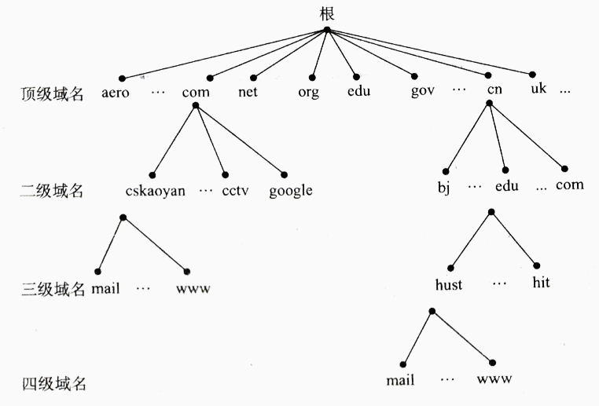
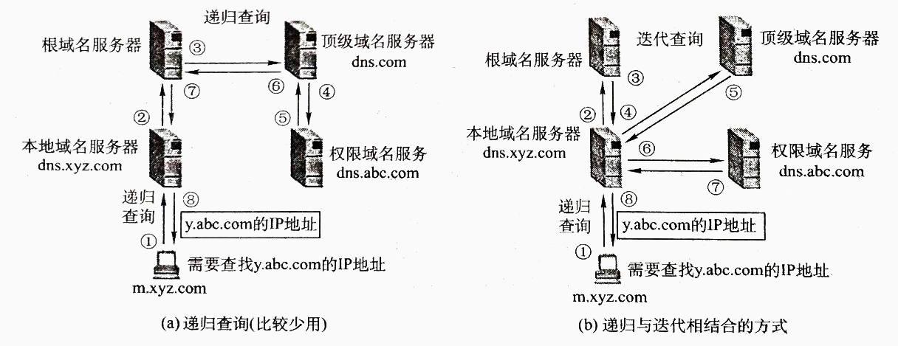

# 计算机网络

## 计算机网络体系结构

- 计算机网络是一个将分散的、具有独立功能的计算机系统，通过通信设备于线路连接起来，由功能完善的软件实现资源共享和信息传递的系统。
- 从组成部分上看，计算机网络主要由硬件、软件、协议三部分组成。
- 计算机网络主要有五大功能：
  - 数据通信
  - 资源共享
  - 分布式处理
  - 提高可靠性
  - 负载均衡
- 计算机网络的性能指标：
  - 时延（Delay）：
    - $发送时延=分组长度/信道宽度$
    - $传播时延=信道长度/电磁波在信道上的传播速率$
    - 处理时延：数据在交换节点进行的一些必要处理所需的时间
    - 排队时延：分组转发前需排队
    - $总时延=发送时延+传播时延+处理时延+排队时延$
  - 往返时延（Round-Trip TIme, RTT）：发送端发送数据到收到确认信息经历的时间。
  - 吞吐量：表示在单位时间内通过某个网络的数据量。

### OSI参考模型和TCP/IP模型

- 面向连接服务：通信前双方必须先建立连接，分配相应资源，以保证通信能正常进行，传输完成后释放资源。
- 无连接服务：通信前双方不需要先建立连接，需要发送数据时直接发送，是一种不可靠服务（“尽最大努力交付”）。
- 可靠服务：具有纠错、检错、应答机制，保证数据正确、可靠地传送到目的地。
- 不可靠服务：尽量正确、可靠的传输，但不保证数据正确、可靠的传送到目的地。

#### OSI参考模型

- OSI参考模型：
  - **应用层** ：提供用户接口，特指能够发起网络流量的程序。数据单位为报文。应用层是最复杂的一层，包含的协议也最多，主要有DNS、FTP、SMTP、HTTP等。
  - **表示层** ：数据压缩、加密以及数据描述。这使得应用程序不必担心在各台主机中表示/存储的内部格式（二进制、ASCII，比如乱码）不同的问题。 
  - **会话层** ：建立会话，如session认证、断点续传。通信的应用程序之间建立、维护和释放面向用户的连接。通信的应用程序之间建立会话，需要传输层建立1个或多个连接。
  - **传输层** ：负责主机中两个进程间的通信，为端到端连接提供流量控制、差错控制、服务质量、数据传数管理等服务。传输层的协议有：
    - 传输控制协议 TCP，提供面向连接、可靠的数据传输服务，数据单位为报文段。
    - 用户数据报协议 UDP，提供无连接、尽最大努力的数据传输服务，数据单位为用户数据报。
    - TCP 主要提供完整性服务，UDP 主要提供及时性服务。
  - **网络层** ：主要任务是把网络层的协议数据单元（分组）从源端传到目的端，关键问题是对分组进行路由选择，并实现流量控制、拥塞控制、差错控制和网际互连等功能。传输单位是数据报。包含的协议主要有IP、NAT、ARP、DHCP、ICMP、RIP、OSPF、BGP等。
  - **数据链路层** ：主要任务是将网络层传下来的IP数据报组装成帧。功能可概括为：成帧、差错控制、流量控制和传数管理等。传输单位是帧（frame）。包含的协议主要有PPP、HDLC等。
  - **物理层** ：主要任务是透明地传输比特流，功能是在物理媒体上为数据端设备透明地传输原始比特流。传输单位是比特（bit）。
    - 机械特性：例接口形状，大小，引线数目
    - 电气特性：例规定电压范围 ( -5V 到 +5V )
    - 功能特性：例规定 -5V 表示 0，＋5V 表示 1
    - 过程特性：也称规程特性，规定建立连接时各个相关部件的工作步骤
- 在向下层传递的过程中，需要添加下层协议所需要的首部或者尾部，而在向上层传递的过程中不断拆开首部和尾部。
  - 路由器只有下面三层协议，因为路由器位于网络核心中，不需要为进程或者应用程序提供服务，因此也就不需要运输层和应用层。
  - 交换机只有下面两层协议

#### TCP/IP模型

它只有四层，相当于五层协议中**数据链路层和物理层合并为网络接口层**。

现在的 TCP/IP 体系结构不严格遵循 OSI 分层概念，应用层可能会直接使用 IP 层或者网络接口层。

  
 

TCP/IP 协议族是一种沙漏形状，中间小两边大，IP 协议在其中占用举足轻重的地位。 

  
 

#### 对比

- 相同：都采用分层的体系结构，都基于独立的协议栈概念，都可以解决异构网络的互联。
- 不同：OSI模型精确定义了服务、协议和接口的概念，而TCP/IP模型不符合软件工程的思想。OSI会有协议不能匹配到模型的情况，而TCP/IP模型没有。OSI模型在网络层支持无连接和面向连接的通信，但传输层仅有面向连接的通信，而TCP/IP模型网际层仅有无连接的通信，而传输层支持无连接和面向连接的通信。

## 应用层

### 网络应用模型

- C/S模型：客户是服务请求方，服务器是服务提供方。客户机之间不直接通信，可扩展性不佳。
- P2P模型：没有客户和服务器的划分，任意一对计算机（对等方，Peer）直接相互通信。
  - 优点：减轻了服务器的压力，可扩展性好，网络更健壮。
  - 缺点：在获取服务时，也要向其他节点提供服务，因此会占用更多内存，影响主机速度。

### DNS

域名系统DNS（Domain Name System）是因特网使用的命名系统，用来把便于人们记忆的含有特定含义的主机名转换为便于机器处理的IP地址。DNS采用C/S模型，运行在UDP之上，使用53号端口。

- 域名分级：

- 域名解析有递归查询和递归与迭代相结合的查询两种，递归方法实际上很少使用。

### FTP

- 采用C/S的工作方式，使用TCP可靠的传输服务。
- FTP使用两个并行的TCP连接：
  - 控制连接（服务器端口21）：用来传输控制信息。
  - 数据连接（服务器端口20）：实际用来传输数据的连接。

### HTTP

- 万维网（WWW）的内核部分是由三个标准构成的：
  - URL：负责标识各种文档，使每个文档有唯一的标识符。
  - HTTP：客户与服务器之间交互时必须遵守的协议。
  - HTML：是一种文档结构标记语言。
- HTTP使用TCP建立可靠连接，使用80号端口。
- HTTP是无状态的，指的是协议对于事务处理没有记忆能力，服务器不知道客户端是什么状态。也就是说，打开一个服务器上的网页和上一次打开这个服务器上的网页之间没有任何联系。HTTP是一个无状态的面向连接的协议，无状态不代表HTTP不能保持TCP连接，更不能代表HTTP使用的是UDP协议（无连接）。 
- 持久连接和非持久连接：
  - 非持久连接：每次传输都要建立一个TCP连接，每次传输完成后关闭连接。
  - 持久连接：服务器在发送响应后仍保持连接，可以继续在这条连接上传送数据。
- HTTP请求报文常用方法

|  方法   |              意义               |
| :-----: | :-----------------------------: |
|   GET   |    请求读取由URL所标识的信息    |
|  HEAD   | 请求读取由URL所标识的信息的首部 |
|  POST   |  给服务器添加信息（例如注释）   |
| CONNECT |         用于代理服务器          |

- Cookie：HTTP 协议是无状态的，主要是为了让 HTTP 协议尽可能简单，使得它能够处理大量事务。HTTP/1.1 引入 Cookie 来保存状态信息。Cookie 是服务器发送到用户浏览器并保存在本地的一小块数据，它会在浏览器下次向同一服务器再发起请求时被携带并发送到服务器上。它用于告知服务端两个请求是否来自同一浏览器，并保持用户的登录状态。

### HTTPs安全性

**HTTP 有以下安全性问题：**

- 使用明文进行通信，内容可能会被窃听；
- 不验证通信方的身份，通信方的身份有可能遭遇伪装；
- 无法证明报文的完整性，报文有可能遭篡改。

HTTPs（Hyper Text Transfer Protocol over Secure Socket Layer），是以安全为目标的HTTP通道，简单讲是HTTP的安全版。

HTTPs 并不是新协议，而是让 HTTP 先和 SSL（Secure Sockets Layer）通信，再由 SSL 和 TCP 通信。也就是说 HTTPs 使用了隧道进行通信。

通过使用 SSL，HTTPs 具有了加密（防窃听）、认证（防伪装）和完整性保护（防篡改）。

 
 

- 对称密钥加密

  对称密钥加密（Symmetric-Key Encryption），加密和解密使用同一密钥。

  - 优点：运算速度快；
  - 缺点：无法安全地将密钥传输给通信方。

  
 

- 非对称密钥加密

  非对称密钥加密，又称公开密钥加密（Public-Key Encryption），加密和解密使用不同的密钥。

  公开密钥所有人都可以获得，通信发送方获得接收方的公开密钥之后，就可以使用公开密钥进行加密，接收方收到通信内容后使用私有密钥解密。

  非对称密钥除了用来加密，还可以用来进行签名。因为私有密钥无法被其他人获取，因此通信发送方使用其私有密钥进行签名，通信接收方使用发送方的公开密钥对签名进行解密，就能判断这个签名是否正确。

  - 优点：可以更安全地将公开密钥传输给通信发送方；
  - 缺点：运算速度慢。

  
 

- HTTPs 采用的加密方式

  HTTPs 采用混合的加密机制，使用非对称密钥加密用于传输对称密钥来保证安全性，之后使用对称密钥加密进行通信来保证效率。

  
 

- 数字签名、数字证书、SSL、https是什么关系？

  HTTPS 是建立在密码学基础之上的一种安全通信协议，严格来说是基于 HTTP 协议和 SSL/TLS 的组合。理解 HTTPS 之前有必要弄清楚一些密码学的相关基础概念，比如：明文、密文、密码、密钥、对称加密、非对称加密、信息摘要、数字签名、数字证书。接下来我会逐个解释这些术语，文章里面提到的『数据』、『消息』都是同一个概念，表示用户之间通信的内容载体，此外文章中提到了以下几个角色：

  - Alice：消息发送者
  - Bob：消息接收者
  - Attacker：中间攻击者
  - Trent：第三方认证机构

- 密码

  密码学中的“密码”术语与网站登录时用的密码（password）是不一样的概念，password 翻译过来其实是“口令”，它是用于认证用途的一组文本字符串。

  而密码学中的密码（cipher）是一套算法(algorithm)，这套算法用于对消息进行加密和解密，从明文到密文的过程称之为加密，密文反过来生成明文称之为解密，加密算法与解密算法合在一起称为密码算法。

- 密钥

  密钥（key）是在使用密码算法过程中输入的一段参数。同一个明文在相同的密码算法和不同的密钥计算下会产生不同的密文。很多知名的密码算法都是公开的，密钥才是决定密文是否安全的重要参数，通常密钥越长，破解的难度越大，比如一个8位的密钥最多有256种情况，使用穷举法，能非常轻易的破解。根据密钥的使用方法，密码可分为对称加密和公钥加密。

- 对称加密

  对称密钥（Symmetric-key algorithm）又称为共享密钥加密，加密和解密使用相同的密钥。常见的对称加密算法有DES、3DES、AES、RC5、RC6。对称密钥的优点是计算速度快，但是它有缺点，接收者需要发送者告知密钥才能解密，因此密钥如何安全的发送给接收者成为了一个问题。

  
 
 

  Alice 给 Bob 发送数据时，把数据用对称加密后发送给 Bob，发送过程中由于对数据进行了加密，因此即使有人窃取了数据也没法破解，因为它不知道密钥是什么。但是同样的问题是 Bob 收到数据后也一筹莫展，因为它也不知道密钥是什么，那么 Alice 是不是可以把数据和密钥一同发给 Bob 呢。当然不行，一旦把密钥和密钥一起发送的话，那就跟发送明文没什么区别了，因为一旦有人把密钥和数据同时获取了，密文就破解了。所以对称加密的密钥配是个问题。如何解决呢，公钥加密是一个办法。

- 公钥加密（非对称加密）

  公开密钥加密（public-key cryptography）简称公钥加密，这套密码算法包含配对的密钥对，分为加密密钥和解密密钥。发送者用加密密钥进行加密，接收者用解密密钥进行解密。加密密钥是公开的，任何人都可以获取，因此加密密钥又称为公钥（public key），解密密钥不能公开，只能自己使用，因此它又称为私钥（private key）。常见的公钥加密算法有 RSA。

  还是以Alice 给 Bob 发送数据为例，公钥加密算法由接收者 Bob 发起

1. Bob 生成公钥和私钥对，私钥自己保存，不能透露给任何人。

2. Bob 把公钥发送给 Alice，发送过程中即使被人窃取也没关系

3. Alice 用公钥把数据进行加密，并发送给 Bob，发送过程中被人窃取了同样没关系，因为没有配对的私钥进行解密是没法破解的

4. Bob 用配对的私钥解密。

   
 
 

   虽然公钥加密解决了密钥配送的问题，但是你没法确认公钥是不是合法的，Bob 发送的公钥你不能肯定真的是 Bob 发的，因为也有可能在 Bob 把公钥发送给 Alice 的过程中出现中间人攻击，把真实的公钥掉包替换。而对于 Alice 来说完全不知。还有一个缺点是它的运行速度比对称加密慢很多。

- 消息摘要

  消息摘要（message digest）函数是一种用于判断数据完整性的算法，也称为散列函数或哈希函数，函数返回的值叫散列值，散列值又称为消息摘要或者指纹（fingerprint）。这种算法是一个不可逆的算法，因此你没法通过消息摘要反向推倒出消息是什么。所以它也称为**单向散列函数**。下载软件时如何确定是官方提供的完整版呢，如果有中间人在软件里面嵌入了病毒，你也不得而知。所以我们可以使用散列函数对消息进行运算，生成散列值，通常软件提供方会同时提供软件的下载地址和软件的散列值，用户把软件下载后在本地用相同的散列算法计算出散列值，与官方提供的散列值对比，如果相同，说明该软件是完成的，否则就是被人修改过了。常用的散列算法有MD5、SHA。

  
 
 

  散列函数可以保证数据的完整性，识别出数据是否被篡改，但它并不能识别出数据是不是伪装的，因为中间人可以把数据和消息摘要同时替换，数据虽然是完整的，但真实数据被掉包了，接收者收到的并不是发送者发的，而是中间人的。消息认证是解决数据真实性的办法。认证使用的技术有消息认证码和数字签名。

- 消息认证码

  消息认证码（message authentication code）是一种可以确认消息完整性并进行认证（消息认证是指确认消息来自正确的发送者）的技术，简称 MAC。消息认证码可以简单理解为一种与密钥相关的单向散列函数。

  
 
 

  Alice 给 Bob 发送消息前，先把共享密钥（key）发送给 Bob，Alice 把消息计算出 MAC 值，连同消息一起发送给 Bob，Bob 接收到消息和 MAC 值后，与本地计算得到 MAC 值对比，如果两者相同，就说明消息是完整的，而且可以确定是 Alice 发送的，没有中间人伪造。不过，消息认证码同样会遇到对称加密的密钥配送问题，因此解决密钥配送问题还是要采用公钥加密的方式。

  此外，消息认证码还有一个无法解决的问题，Bob 虽然可以识别出消息的篡改和伪装，但是 Alice 可以否认说：“我没发消息，应该是 Bob 的密钥被 Attacker 盗取了，这是 Attacker 发的吧”。Alice 这么说你还真没什么可以反驳的，那么如何防止 Alice 不承认呢，数字签名可以实现。

- 数字签名

  Alice 发邮件找 Bob 借1万钱，因为邮件可以被人篡改（改成10万），也可以被伪造（Alice 根本就没发邮件，而是 Attacker 伪造 Alice 在发邮件），Alice 借了钱之后还可以不承认（不是我借的，我没有签名啊）。

  **消息认证码**可以解决篡改和伪造的问题，Alice 不承认自己借了钱时，Bob 去找第三方机构做公正，即使这样，公正方也没法判断 Alice 有没有真的借钱，因为他们俩共享了密钥，也就是说两个都可以计算出正确的 MAC 值，Bob 说：“明明你发的消息和 MAC 值和我自己生成的 MAC 值一样，肯定是你发的消息”，Alice 说：“你把密钥透露给了其他人，是他发的邮件，你找他去吧”。Alice 矢口否认。

  数字签名（Digital Signature）就可以解决否认的问题，发送消息时，Alice 和 Bob 使用不同的密钥，把公钥加密算法反过来使用，发送者 Alice 使用私钥对消息进行签名，而且只能是拥有私钥的 Alice 可以对消息签名，Bob 用配对的公钥去验证签名，第三方机构也可以用公钥验证签名，如果验证通过，说明消息一定是 Alice 发送的，抵赖也不行，因为你只有 Alice 可以生成签名。这就防止了否认的问题。

  
 
 

  它的流程是:

  第一步：发送者 Alice **把消息哈希函数处理生成消息摘要，摘要信息使用私钥加密之后生成签名**，连同消息一起发送给接收者 Bob。

  第二步：数据经过网络传输，Bob收到数据后，把签名和消息分别提取出来。

  第三步：对签名进行验证，验证的过程是先把消息提取出来做同样的Hash处理，得到消息摘要，再与 Alice 传过来的签名用公钥解密，如果两者相等，就表示签名验证成功，否则验证失败，表示不是 Alice发的。

- 公钥证书

  公钥密码在数字签名技术里面扮演举足轻重的角色，但是如何保证公钥是合法的呢，如果是遭到中间人攻击，掉包怎么办？这个时候公钥就应该交给一个第三方权威机构来管理，这个机构就是认证机构（Certification Authority）CA，CA 把用户的姓名、组织、邮箱地址等个人信息收集起来，还有此人的公钥，并由 CA 提供数字签名生成公钥证书（Public-Key Certificate）PKC，简称证书。

  
 
 

  Alice 向 Bob 发送消息时，是通过 Bob 提供的公钥加密后的数据，而 Alice 获取的公钥并不是由 Bob 直接给的，而是由委托一个受信任的第三方机构给的。

1. Bob 生成密钥对，私钥自己保管，公钥交给认证机构 Trent。
2. Trent 经过一系列严格的检查确认公钥是 Bob 本人的
3. Trent 事先也生成自己的一套密钥对，用自己的私钥对 Bob 的公钥进行数字签名并生成数字证书。证书中包含了 Bob 的公钥。公钥在这里是不需要加密的，因为任何人获取 Bob 的公钥都没事，只要确定是 Bob 的公钥就行。
4. Alice 获取 Trent 提供的证书。
5. Alice 用 Trent 提供的公钥对证书进行签名验证，签名验证成功就表示证书中的公钥是 Bob 的。
6. 于是 Alice 就可以用 Bob 提供的公钥对消息加密后发送给 Bob。
7. Bob 收到密文后，用与之配对的私钥进行解密。

至此，一套比较完善的数据传输方案就完成了。HTTPS（SSL/TLS）就是在这样一套流程基础之上建立起来的。

## 传输层

网络层只把分组发送到目的主机，但是真正通信的并不是主机而是主机中的进程。传输层提供了进程间的逻辑通信，传输层向高层用户屏蔽了下面网络层的核心细节，使应用程序看起来像是在两个运输层实体之间有一条端到端的逻辑通信信道。

### 端口

端口能让应用层各种进程将其数据通过端口交付给传输层，以及让传输层知道数据该交付到哪个进程。端口在传输层的作用相当于IP地址在网络层的作用或MAC地址在数据链路层的作用。

端口号长度16bit，能够表示65536个不同端口号。端口号只具有本地意义，不同计算机的端口号之间没有联系。根据端口号的范围可将其分为两类：

- 服务器使用的端口号：
  - 熟知端口号：0-1023
  - 登记端口号：1024-49151
- 客户端使用的端口号：49152-65535

### UDP

**用户数据报协议 UDP**（User Datagram Protocol）是无连接的，尽最大可能交付，没有拥塞控制，面向报文（对于应用程序传下来的报文不合并也不拆分，只是添加 UDP 首部），支持一对一、一对多、多对一和多对多的交互通信。例如：视频传输、实时通信。

- UDP首部格式：

  
 

首部字段只有 8 个字节，包括源端口、目的端口、长度、检验和。其中源端口号在不需要时可用全零；长度字段是UDP数据报的长度而不是首部的长度，并且不包括伪首部；校验和字段是可选的，它对伪首部、UDP报文头和应用层数据进行校验。

当接收到有差错的UDP数据报时，直接将其丢弃，并不采取其他措施。

### TCP

**传输控制协议 TCP**（Transmission Control Protocol）是面向连接的，提供可靠交付，有流量控制，拥塞控制，提供全双工通信，面向字节流（把应用层传下来的报文看成字节流，把字节流组织成大小不等的数据块），每一条 TCP 连接只能是点对点的（一对一）。

#### 首部格式

  
 

- **序号 seq** ：用于对字节流进行编号，例如序号为 301，表示第一个字节的编号为 301，如果携带的数据长度为 100 字节，那么下一个报文段的序号应为 401。[301,400]为序号301的数据长度，下一个则为401
- **确认号 ack** ：期望收到的下一个报文段的序号。例如 B 正确收到 A 发送来的一个报文段，序号为 501，携带的数据长度为 200 字节，因此 B 期望下一个报文段的序号为 701，B 发送给 A 的确认报文段中确认号就为 701。
- **数据偏移** ：指的是数据部分距离报文段起始处的偏移量，实际上指的是首部的长度。
- **确认 ACK** ：当 ACK=1 时确认号字段有效，否则无效。TCP 规定，在连接建立后所有传送的报文段都必须把 ACK 置 1。
- **同步 SYN** ：在连接建立时用来同步序号。当 SYN=1，ACK=0 时表示这是一个连接请求报文段。若对方同意建立连接，则响应报文中 SYN=1，ACK=1。
- **终止 FIN** ：用来释放一个连接，当 FIN=1 时，表示此报文段的发送方的数据已发送完毕，并要求释放连接。
- **窗口** ：窗口值作为接收方让发送方设置其发送窗口的依据。之所以要有这个限制，是因为接收方的数据缓存空间是有限的。

#### 连接建立（三次握手）

  
 

**假设 A 为客户端，B 为服务器端。**

- 首先 B 处于 LISTEN（监听）状态，等待客户的连接请求。
- A 向 B 发送连接请求报文段，SYN=1，~~ACK=0~~，随机选择一个初始的序号 seq = x。
- B 收到连接请求报文段，如果同意建立连接，则向 A 发送连接确认报文段，SYN=1，ACK=1，确认号为 x+1，同时也随机选择一个初始的序号 seq = y。
- A 收到 B 的连接确认报文段后，还要向 B 发出确认，确认号为 ack = y+1，序号为 seq = x+1。
- A 的 TCP 通知上层应用进程，连接已经建立。
- B 收到 A 的确认后，连接建立。
- B 的 TCP 收到主机 A 的确认后，也通知其上层应用进程：TCP 连接已经建立。

**为什么TCP连接需要三次握手，两次不可以吗，为什么？**

**为了防止已失效的连接请求报文段突然又传送到了服务端，占用服务器资源。 （假设主机A为客户端，主机B为服务器端）**

现假定出现一种异常情况，即A发出的第一个连接请求报文段并没有丢失，而是在某些网络节点长时间滞留了，以致延误到连接释放以后的某个时间才到B。本来这是一个已失效的报文段。但是B收到此失效的连接请求报文段后，就误认为是A有发出一次新的连接请求。于是就向A发出确认报文段，同意建立连接。假定不采用三次握手，那么只要B发出确认，新的连接就建立了。

由于现在A并没有发出建立连接的请求，因此不会理睬B的确认，也不会向B发送数据。但B却以为新的运输连接已经建立了，并一直等待A发来数据。B的许多资源就这样白白浪费了。

采用三次握手的办法可以防止上述现象的发生。例如在刚才的情况下，A不会向B的确认发出确认。B由于收不到确认，就知道A并没有要求建立连接。

#### 连接释放（四次挥手）

  
 

数据传输结束后，通信的双方都可释放连接。现在 A 的应用进程先向其 TCP 发出连接释放报文段，并停止再发送数据，主动关闭 TCP连接。

- A 把连接释放，报文段首部的 FIN = 1，其序号 seq = u，等待 B 的确认。
- B 发出确认，确认号 ack = u+1，而这个报文段自己的序号 seq = v。（TCP 服务器进程通知高层应用进程）
- 从 A 到 B 这个方向的连接就释放了，TCP 连接处于半关闭状态。B 能向 A 发送数据但是 A 不能向 B 发送数据。
- 当 B 不再需要连接时，发送连接释放请求报文段，FIN=1。
- A 收到后发出确认，进入 TIME-WAIT 状态，等待 2 MSL 时间后释放连接。
- B 收到 A 的确认后释放连接。

**为什么要四次挥手？**

客户端发送了 FIN 连接释放报文之后，服务器收到了这个报文，就进入了 CLOSE-WAIT 状态。这个状态是为了让服务器端发送还未传送完毕的数据，传送完毕之后，服务器会发送 FIN 连接释放报文。

- TIME-WAIT

> MSL是Maximum Segment Lifetime英文的缩写，中文可以译为 “报文最大生存时间”，他是任何报文在网络上存在的最长时间，超过这个时间报文将被丢弃。2MSL = 2*2mins = 4mins

客户端接收到服务器端的 FIN 报文后进入此状态，此时并不是直接进入 CLOSED 状态，还需要等待一个时间计时器设置的时间 2MSL。这么做有两个理由：

- 确保最后一个确认报文段能够到达。如果 B 没收到 A 发送来的确认报文段，那么就会重新发送连接释放请求报文段，A 等待一段时间就是为了处理这种情况的发生。
- 等待一段时间是为了让本连接持续时间内所产生的所有报文段都从网络中消失，使得下一个新的连接不会出现旧的连接请求报文段。

#### 可靠传输

- 应用数据被分割成TCP认为最适合发送的数据块。 

- TCP给发送的每一个字节进行编号，接收方对数据进行排序，把有序数据传送给应用层。 

- **累计确认**：TCP只确认数据流中至第一个丢失字节为止的字节。

- **超时重传**：当TCP发出一个段后，它启动一个定时器，等待目的端确认收到这个报文段。发送端发送报文后若长时间未收到确认的报文则需要重发该报文。可能有以下几种情况：

  - 发送的数据没能到达接收端，所以对方没有响应。
  - 接收端接收到数据，但是ACK报文在返回过程中丢失。
  - 接收端拒绝或丢弃数据。

  如果不能及时收到一个确认，将重发这个报文段。

  - **往返时间（RTT）**：数据从发送到接收到对方响应之间的时间间隔，即数据报在网络中一个往返用时。大小不稳定。$新的RTT_s=(1-\alpha)\times (旧的RTT_s)+\alpha \times(新的RTT样本)$ 。

  - **超时重传时间（RTO）**：从上一次发送数据，因为长期没有收到ACK响应，到下一次重发之间的时间。就是重传间隔。
    - $RTO=RTT_S + 4\times RTT_D$
    - 通常每次重传RTO是前一次重传间隔的两倍，计量单位通常是RTT。例：1RTT，2RTT，4RTT，8RTT......
    - 重传次数到达上限之后停止重传。

- **校验和**：TCP将保持它首部和数据的检验和。这是一个端到端的检验和，目的是检测数据在传输过程中的任何变化。如果收到段的检验和有差错，TCP将丢弃这个报文段和不确认收到此报文段。

- TCP的接收端会丢弃重复的数据。

- **流量控制**：TCP连接的每一方都有固定大小的缓冲空间，TCP的接收端只允许发送端发送接收端缓冲区能接纳的我数据。当接收方来不及处理发送方的数据，能提示发送方降低发送的速率，防止包丢失。TCP使用的流量控制协议是可变大小的滑动窗口协议。

- **拥塞控制**：当网络拥塞时，减少数据的发送。 

#### 流量控制（滑动窗口）

  
 

窗口是缓存的一部分，用来暂时存放字节流。发送方和接收方各有一个窗口，**接收方通过 TCP 报文段中的窗口字段告诉发送方自己的窗口大小，发送方根据这个值和其它信息设置自己的窗口大小**。

发送窗口内的字节都允许被发送，接收窗口内的字节都允许被接收。如果发送窗口左部的字节已经发送并且收到了确认，那么就将发送窗口向右滑动一定距离，直到左部第一个字节不是已发送并且已确认的状态；接收窗口的滑动类似，接收窗口左部字节已经发送确认并交付主机，就向右滑动接收窗口。

接收窗口只会对窗口内最后一个按序到达的字节进行确认，例如接收窗口已经收到的字节为 {31, 34, 35}，其中 {31} 按序到达，而 {32, 33} 就不是，因此只对字节 31 进行确认。发送方得到一个字节的确认之后，就知道这个字节之前的所有字节都已经被接收。

**以下进行滑动窗口模拟**

在 TCP 中，**滑动窗口是为了实现流量控制**。如果对方发送数据过快，接收方就来不及接收，接收方就需要通告对方，减慢数据的发送。 

 
 

- **发送方接收到了对方发来的报文 ack = 33, win = 10，知道对方收到了 33 号前的数据**，现在期望接收 [33, 43) 号数据。发送方连续发送了 4 个报文段假设为 A, B, C, D, 分别携带 [33, 35), [35, 36), [36, 38), [38, 41) 号数据。
- 接收方接收到了报文段 A, C，但是没收到 B 和 D，也就是只收到了 [33, 35) 和 [36, 38) 号数据。接收方发送回对报文段 A 的确认：ack = 35, win = 10。
- 发送方收到了 ack = 35, win = 10，对方期望接收 [35, 45) 号数据。接着发送了一个报文段 E，它携带了 [41, 44) 号数据。
- 接收方接收到了报文段 B: [35, 36), D:[38, 41)，接收方发送对 D 的确认：ack = 41, win = 10. （这是一个累积确认）
- 发送方收到了 ack = 41, win = 10，对方期望接收 [41, 51) 号数据。
- ……
- 需要注意的是，接收方接收 tcp 报文的顺序是不确定的，并非是一定先收到 35 再收到 36，也可能是先收到 36，37，再收到 35.

#### 拥塞控制

拥塞控制的一般原理

- 在某段时间，若对网络中某资源的需求超过了该资源所能提供的可用部分，网络的性能就要变坏——产生拥塞(congestion)。
- 出现资源拥塞的条件：对资源需求的总和 > 可用资源
- 若网络中有许多资源同时产生拥塞，网络的性能就要明显变坏，整个网络的吞吐量将随输入负荷的增大而下降。  

如果网络出现拥塞，分组将会丢失，此时发送方会继续重传，从而导致网络拥塞程度更高。因此当出现拥塞时，应当控制发送方的速率。这一点和流量控制很像，但是出发点不同。流量控制是为了让接收方能来得及接收，而拥塞控制是为了降低整个网络的拥塞程度。

  
 

TCP 主要通过四种算法来进行拥塞控制：慢开始、拥塞避免、快重传、快恢复。

发送方需要维护一个叫做拥塞窗口（cwnd）的状态变量，注意拥塞窗口与发送方窗口的区别：拥塞窗口只是一个状态变量，实际决定发送方能发送多少数据的是发送方窗口。

为了便于讨论，做如下假设：

- 接收方有足够大的接收缓存，因此不会发生流量控制；
- 虽然 TCP 的窗口基于字节，但是这里设窗口的大小单位为报文段。

 
  
 

- 慢开始与拥塞避免

  发送的最初执行慢开始，令 cwnd=1，发送方只能发送 1 个报文段；当收到确认后，将 cwnd 加倍，因此之后发送方能够发送的报文段数量为：2、4、8 ...

  注意到慢开始每个轮次都将 cwnd 加倍，这样会让 cwnd 增长速度非常快，从而使得发送方发送的速度增长速度过快，网络拥塞的可能也就更高。设置一个慢启动阈值 ssthresh，当 cwnd >= ssthresh 时，进入拥塞避免，每个轮次只将 cwnd 加 1。

  如果出现了超时，则令 ssthresh = cwnd/2，然后重新执行慢开始。

- 快重传与快恢复

  在接收方，要求每次接收到报文段都应该对最后一个已收到的有序报文段进行确认。例如已经接收到 M1 和 M2，此时收到 M4，应当发送对 M2 的确认。

  在发送方，如果收到三个重复确认，那么可以知道下一个报文段丢失，此时执行快重传，立即重传下一个报文段。例如收到三个 M2，则 M3 丢失，立即重传 M3。

  在这种情况下，只是丢失个别报文段，而不是网络拥塞。因此执行快恢复，令 ssthresh = cwnd/2 ，cwnd = ssthresh，注意到此时直接进入拥塞避免。慢开始和快恢复的快慢指的是 cwnd 的设定值，而不是 cwnd 的增长速率。慢开始 cwnd 设定为 1，而快恢复 cwnd 设定为 ssthresh。

  
 

- 发送窗口的上限值

  发送方的发送窗口的上限值应当取为接收方窗口 rwnd 和拥塞窗口 cwnd 这两个变量中较小的一个，即应按以下公式确定：

  $发送窗口的上限值 =  \min (rwnd, cwnd)$

  - 当 $rwnd < cwnd$ 时，是接收方的接收能力限制发送窗口的最大值。
  - 当 $cwnd < rwnd$ 时，则是网络的拥塞限制发送窗口的最大值。 

#### 流量控制和拥塞控制对比

- 拥塞控制所要做的都有一个前提，就是网络能够承受现有的网络负荷。
- 拥塞控制是一个全局性的过程，涉及到所有的主机、所有的路由器，以及与降低网络传输性能有关的所有因素。
- 流量控制往往指在给定的发送端和接收端之间的点对点通信量的控制。
- 流量控制所要做的就是抑制发送端发送数据的速率，以便使接收端来得及接收。 

- 流量控制属于通信双方协商；拥塞控制涉及通信链路全局。
- 流量控制需要通信双方各维护一个发送窗、一个接收窗，对任意一方，接收窗大小由自身决定，发送窗大小由接收方响应的TCP报文段中窗口值确定；拥塞控制的拥塞窗口大小变化由试探性发送一定数据量数据探查网络状况后而自适应调整。
- $实际最终发送窗口 = \min (流控发送窗口，拥塞窗口)$。

### UDP和TCP对比

- TCP和UDP区别 
  - UDP 是无连接的，即发送数据之前不需要建立连接。 
  - UDP 使用尽最大努力交付，即不保证可靠交付，同时也不使用拥塞控制。 
  - UDP 是面向报文的。UDP 没有拥塞控制，很适合多媒体通信的要求。 
  - UDP 支持一对一、一对多、多对一和多对多的交互通信。 
  - UDP 的首部开销小，只有 8 个字节。 
  - TCP 是面向连接的运输层协议。 
  - 每一条 TCP 连接只能有两个端点(endpoint)，每一条 TCP 连接只能是点对点的（一对一）。 
  - TCP 提供可靠交付的服务。 
  - TCP 提供全双工通信。 
  - TCP是面向字节流。   
  - 首部最低20个字节。 
- TCP加快传输效率的方法 
  - 采取一块确认的机制 

## 网络层

### IPv4

#### IP数据报格式

- 版本
- 首部长度：以4字节为单位，最大值为60字节，最常用的是20字节（不适用任何可选字段）。
- 总长度：以1字节为单位，指首部和数据之和的长度。最大不能超过数据链路层MTU值。
- 标识：计数器，每产生一个数据报就+1。
- 标志：用来标记是否还有分片，是否可以分片。
- 片偏移：分片后在原分组中的相对位置，以8个字节为单位。
- 首部校验和：只校验首部，不校验数据。
- 生存时间TTL：可通过的路由器最大值。
- 协议：TCP or UDP。
- 源地址
- 目的地地址

#### IPv4地址

传统的IP地址分为A, B, C, D, E五类。

各类中有一些IP地址表示特殊用途，不能作为主机IP地址：

- 主机号全0表示网络本身。
- 主机号全1表示本网络的广播地址。
- 127.0.0.0网络保留作为环路自检地址。
- 32位全0，表示本网络上本主机。
- 31位全1，表示整个TCP/IP网络的广播地址，又称受限广播地址。

#### NAT

将专用网络转换为公用地址，从而对外隐藏了内部管理的IP地址，大大节省了IP地址的消耗。

私有IP地址（必须用NAT转换为合法的全球IP地址才能用于Internet）：

- A类：1个网段，10.0.0.0~10.255.255.255
- B类：16个网段，172.16.0.0~172.31.255.255
- C类：256个网段，192.168.0.0~192.168.255.255

#### 子网划分

两级IP地址有时候利用率很低，因此增加了子网字段变为三级地址。从主机号接用若干bit作为子网号。

- 子网掩码：表示对原网络中主机号的借位。
- CIDR：消除传统ABC类的划分 ，将IP地址分为网络前缀和主机号两级，大幅提高IP地址的利用率，减小路由表大小，提高路由转发能力。

#### ARP协议

每个主机维护各主机和路由器的IP地址到MAC地址的映射表，称ARP表。

#### DHCP协议

DHCP租约过程就是DHCP客户机动态获取IP地址的过程。

DHCP租约过程分为4步：

1. 客户机请求IP（客户机发DHCPDISCOVER广播包）；
2. 服务器响应（服务器发DHCPOFFER广播包）；
3. 客户机选择IP（客户机发DHCPREQUEST广播包）；
4. 服务器确定租约（服务器发DHCPACK/DHCPNAK广播包）。

#### ICMP协议

为了提高IP数据报交付成功的机会，使用ICMP协议来允许主机或路由器报告差错和异常情况。

ICMP差错报告有五种类型：

1. 终点不可达
2. 源点抑制（拥塞）
3. 时间超时
4. 参数问题
5. 改变路由

### IPv6

主要特点：

1. 更大的地址空间（128位）。
2. 扩展的地址层次结构。
3. 灵活的首部格式。
4. 改进的选项。
5. 允许协议继续扩充。
6. 支持即插即用（自动配置）。
7. 支持资源预分配。
8. 只有在包的源节点才能被分片，传输路径中不能被分片。
9.  首部长度是8B的整数倍。
10. 增加了安全性（身份验证和保密功能）。

### 路由协议

#### RIP

#### OSPF

#### BGP

### 交换机和路由器的区别

1. 路由器可以给你的局域网自动分配IP，虚拟拨号，就像一个交通警察，指挥着你的电脑该往哪走，你自己不用操心那么多了。交换机只是用来分配网络数据的。
2. 路由器在网络层，路由器根据IP地址寻址，路由器可以处理TCP/IP协议，交换机不可以。
3. 交换机在中继层，交换机根据MAC地址寻址。路由器可以把一个IP分配给很多个主机使用，这些主机对外只表现出一个IP。交换机可以把很多主机连起来，这些主机对外各有各的IP。
4. 路由器提供防火墙的服务，交换机不能提供该功能。集线器、交换机都是做端口扩展的，就是扩大局域网(通常都是以太网)的接入点，也就是能让局域网可以连进来更多的电脑。路由器是用来做网间连接，也就是用来连接不同的网络。

交换机是利用**物理地址或者说MAC地址**来确定转发数据的目的地址。而路由器则是利用不同网络的ID号(即IP地址)来确定数据转发的地址。IP地址是在软件中实现的，描述的是设备所在的网络，有时这些第三层的地址也称为协议地址或者网络地址。MAC地址通常是硬件自带的，由网卡生产商来分配的，而且已经固化到了网卡中去，一般来说是不可更改的。而IP地址则通常由网络管理员或系统自动分配。

 

**路由器和交换机的区别一**：交换机是一根网线上网，但是大家上网是分别拨号，各自使用自己的宽带，大家上网没有影响。而路由器比交换机多了一个虚拟拨号功能，通过同一台路由器上网的电脑是共用一个宽带账号，大家上网要相互影响。
**路由器和交换机的区别二**：交换机工作在中继层，交换机根据MAC地址寻址。路由器工作在网络层，根据IP地址寻址，路由器可以处理TCP/IP协议，而交换机不可以。

**路由器和交换机的区别三**：交换机可以使连接它的多台电脑组成局域网，如果还有代理服务器的话还可以实现同时上网功能而且局域网所有电脑是共享它的带宽速率的，但是交换机没有路由器的自动识别数据包发送和到达地址的功能。路由器可以自动识别数据包发送和到达的地址，路由器相当于马路上的警察，负责交通疏导和指路的。

**路由器和交换机的区别四**：举几个例子,路由器是小邮局，就一个地址(IP)，负责一个地方的收发(个人电脑，某个服务器，所以你家上网要这个东西)，交换机是省里的大邮政中心，负责由一个地址给各个小地方的联系。简单的说路由器专管入网，交换机只管配送，路由路由就是给你找路让你上网的，交换机只负责开门，交换机上面要没有路由你是上不了网的。

**路由器和交换机的区别五**：路由器提供了防火墙的服务。路由器仅仅转发特定地址的数据包，不传送不支持路由协议的数据包传送和未知目标网络数据包的传送，从而可以防止广播风暴。

